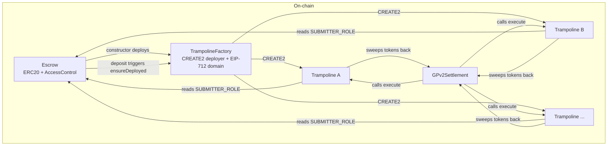

# Contracts reference

The on-chain component of BYOS: three contracts that hold collateral, sandbox route execution, and anchor EIP-712 proposal signatures. All are immutable — no proxies, no upgrade keys. A v2 means a new deployment.

The authoritative Solidity interfaces, NatSpec, and tests live in [`bleu/byos-contracts`](https://github.com/bleu/byos-contracts). This page is a reference summary; the [design document](design-document) is normative on semantics.

## Contract topology



Each sub-solver gets exactly one Trampoline instance, deployed at a deterministic CREATE2 address derived from their address. The Escrow, factory, and EIP-712 domain form one deployment generation — a factory redeployment invalidates all outstanding proposal signatures.

## Escrow

A per-chain, native-token **ERC20 contract** (inheriting OpenZeppelin's ERC20 + AccessControlDefaultAdminRules) holding sub-solver collateral. Tokens are minted 1:1 with deposited ETH and burned on withdrawal or debit.

**Core invariant:** `totalSupply() + accumulatedDebits == address(this).balance`

### Roles

| Role | Holder | Powers | Limits |
|---|---|---|---|
| **Owner** (DEFAULT_ADMIN_ROLE) | Multisig / Safe | Set cooldown, grant/revoke roles, transfer ownership (two-step), receive debited funds | — |
| **Operator** (OPERATOR_ROLE) | BYOS service EOA | `debit`, `freeze`, `unfreeze`, `pause`, `unpause` | Cannot withdraw funds, change config, or grant submitters |
| **Submitter** (SUBMITTER_ROLE) | Solver EOA + auxiliary accounts | Identified by `tx.origin` in `Trampoline.execute` | No escrow authority at all; exists only for the Trampoline gate |

A compromised operator can grief (debit falsely, freeze, pause) but cannot steal — debited funds always go to the Owner. The Owner can replace the operator immediately.

### Functions

#### Anyone

| Function | What it does |
|---|---|
| `deposit(address subSolver) payable` | Mints tokens 1:1 with ETH. Deploys the Trampoline if this is the first deposit for that address. Reverts if `msg.value == 0` or the receiver has a pending withdrawal. |
| `withdrawDebits()` | Sweeps `accumulatedDebits` to `defaultAdmin()`. Callable by anyone (keeper-friendly). Reverts if admin renounced or nothing to sweep. |

#### Sub-solver

| Function | What it does |
|---|---|
| `requestWithdrawal()` | Signals intent to withdraw the entire balance. `effectiveBalance` drops to zero immediately (sub-solver is offline for proposals). Starts the cooldown clock. |
| `executeWithdrawal()` | After cooldown: burns tokens, sends ETH. Reverts if frozen, paused, cooldown not elapsed, or no balance. |
| `cancelWithdrawal()` | Aborts the request, restores `effectiveBalance`. Callable regardless of freeze/pause state. |

#### Operator

| Function | What it does |
|---|---|
| `debit(address subSolver, uint256 amount, bytes32 reason)` | Burns tokens, accumulates to `accumulatedDebits`. Works on frozen addresses and during pause. Reverts if `amount > balanceOf`. |
| `freeze(address subSolver)` | Blocks `executeWithdrawal` and transfers for this address. No-op if already frozen. |
| `unfreeze(address subSolver)` | Restores withdrawal and transfer ability. No-op if not frozen. |
| `pause()` | Global emergency brake: blocks all transfers and `executeWithdrawal`. Deposits, debits, and withdrawal requests stay open. |
| `unpause()` | Restores normal operation. |

#### Owner

| Function | What it does |
|---|---|
| `setCooldownPeriod(uint256 period)` | Updates the withdrawal cooldown. |
| `grantRole / revokeRole` | Manage OPERATOR_ROLE and SUBMITTER_ROLE. |
| `beginDefaultAdminTransfer / acceptDefaultAdminTransfer` | Two-step ownership transfer (prevents address typos from bricking the contract). |

#### Views

| Function | Returns |
|---|---|
| `balanceOf(address)` | Token balance (single source of truth for escrow). |
| `effectiveBalance(address)` | 0 if withdrawal pending, else `balanceOf`. Freeze does not affect it. |
| `withdrawableBalance()` | Accumulated debit pool available to the Owner. |
| `frozen(address)` | Whether an address is frozen. |
| `cooldownPeriod()` | Current cooldown in seconds. |
| `withdrawalRequestedAt(address)` | Request timestamp, or 0. |
| `paused()` | Global pause state. |

### Events

| Event | When |
|---|---|
| `Deposited(address subSolver, uint256 amount)` | Sub-solver's balance increased. |
| `Debited(address subSolver, uint256 amount, bytes32 reason)` | Operator penalized a sub-solver. `reason` = tx hash (Track A), claim id (Track B), or `keccak256(subSolver)` (buffer clearing). |
| `Withdrawn(address subSolver, uint256 amount)` | Sub-solver withdrew after cooldown. |
| `Frozen(address subSolver)` | Address frozen (Track B investigation). |
| `Unfrozen(address subSolver)` | Address unfrozen. |
| `WithdrawalRequested(address subSolver)` | Withdrawal intent registered. |
| `WithdrawalCancelled(address subSolver)` | Withdrawal aborted. |
| `DebitsWithdrawn(address to, uint256 amount)` | Accumulated debits swept to Owner. |
| `CooldownPeriodUpdated(uint256 oldPeriod, uint256 newPeriod)` | Cooldown changed. |
| `Paused(address account)` / `Unpaused(address account)` | Global pause toggled. |
| `Transfer` / `Approval` | Standard ERC20 (inherited). |

### Transfer restrictions

The token is deliberately transfer-restricted — it represents escrowed collateral, not a tradeable asset.

| Condition | Transfer | Mint (deposit) | Burn (debit/withdrawal) |
|---|---|---|---|
| Paused | blocked | allowed | no restriction |
| Sender frozen | blocked | n/a | no restriction |
| Receiver frozen | blocked | allowed | n/a |
| Sender withdrawing | blocked | n/a | no restriction |
| Receiver withdrawing | blocked | blocked | n/a |

Transfers exist for **key rotation**: `transfer(newAddress, fullBalance)` moves collateral without the uncollateralized gap of a withdraw-and-redeposit cycle. Both `transfer` and `transferFrom` call `ensureDeployed` on the recipient.

### How BYOS interacts with Escrow

- **At validation** (every tick): reads `effectiveBalance(subSolver)` to gate proposal eligibility. Cached with a short TTL.
- **At Track A penalty**: calls `debit(subSolver, amount, txHash)` after a reverted settlement. Reads `eth_getTransactionReceipt` first to determine `gas used × gas price`.
- **At Track B investigation**: calls `freeze(subSolver)` on receipt of a CoW EBBO certificate. Calls `debit` if upheld, `unfreeze` if overturned.
- **At buffer clearing**: when a sub-solver's outstanding buffer balance exceeds `c_l`, calls `debit(subSolver, balance, keccak256(subSolver))`.
- **Incident response**: `pause()` → trace `Transfer` events → `freeze` tainted addresses → `unpause()` → `debit` at leisure.

## Trampoline

A per-sub-solver execution sandbox. Receives the sell token, runs the sub-solver's signed route, sweeps both trade tokens back to `GPv2Settlement`, and enforces the `minBuyAmount` floor via a balance-delta check. Holds **zero balance at rest** — a planted approval over an empty contract drains nothing.

### Functions

#### Primary execution

```solidity
function execute(
    Proposal calldata _proposal,
    Interaction[] calldata _interactions,
    address _sellToken,
    address _buyToken,
    bytes calldata _signature
) external
```

Only callable when all gates pass:
1. `msg.sender == GPv2Settlement` — must be within a settlement context.
2. `tx.origin` holds `SUBMITTER_ROLE` on the Escrow — must be BYOS's submitter, not a rival solver replaying public calldata.
3. `block.timestamp <= proposal.validUntil` — proposal not expired.
4. `proposal.nonce` not previously used — replay protection.
5. EIP-712 signature over `ProposalData + interactionsHash` recovers to `SUB_SOLVER` — proves the sub-solver consented to this exact route.

Then:
1. Records `GPv2Settlement`'s current buy-token balance.
2. Executes each interaction as `call(gas, target, value, calldata)`.
3. Sweeps full remaining balance of both trade tokens back to `GPv2Settlement`.
4. Asserts the settlement's buy-token balance grew by at least `minBuyAmount`. Reverts if not.

Emits `Executed(orderUidHash, delta, floor, ceiling)` where `floor` = `minBuyAmount` and `ceiling` = `quoteBuyAmount`.

#### Residue claim

| Function | What it does |
|---|---|
| `claimToken(address token, address recipient)` | Sub-solver only. Transfers full balance of `token` to `recipient`. Use `BUY_ETH_ADDRESS` for native ETH. |
| `claimTokens(address[] tokens, address recipient)` | Batch claim. |

These exist for intermediate-token dust and stray transfers. Trade tokens are swept by `execute` and never strand.

#### Views

| Function | Returns |
|---|---|
| `SUB_SOLVER()` | The sub-solver address (proposal signatures must recover to this). |
| `SETTLEMENT()` | `GPv2Settlement` address (only allowed `execute` caller). |
| `DOMAIN_SEPARATOR()` | EIP-712 domain from the deploying factory. |
| `ESCROW()` | Escrow address (submitter registry). |
| `noncesUsed(uint256)` | Whether a nonce has been consumed. |

### Events

| Event | When |
|---|---|
| `Executed(bytes32 orderUidHash, uint256 delta, uint256 floor, uint256 ceiling)` | Route executed. `delta` = actual buy-token balance growth; `floor` = signed `minBuyAmount`; `ceiling` = signed `quoteBuyAmount`. |
| `ResidueClaimed(address token, uint256 amount, address recipient)` | Sub-solver claimed residue. |

### Errors

| Error | Cause |
|---|---|
| `Trampoline_OnlySettlement()` | Caller is not `GPv2Settlement`. |
| `Trampoline_UnauthorizedSubmitter()` | `tx.origin` does not hold `SUBMITTER_ROLE`. |
| `Trampoline_ProposalExpired()` | `block.timestamp > validUntil`. |
| `Trampoline_NonceAlreadyUsed()` | Nonce was consumed in a prior execution. |
| `Trampoline_InvalidSignature()` | Recovered signer is not `SUB_SOLVER`. |
| `Trampoline_FloorNotMet(uint256 delta, uint256 floor)` | Route delivered less than the signed `minBuyAmount` floor. Settlement reverts entirely. |
| `Trampoline_OnlySubSolver()` | `claimToken` / `claimTokens` caller is not the sub-solver. |
| `Trampoline_EthClaimFailed()` | Native ETH transfer failed during `claimToken`. |

### How BYOS interacts with Trampoline

- **At simulation**: builds a full `settle()` call via `eth_estimateGas` that includes `trampoline.execute(...)`. Uses state overrides for `AnyoneAuthenticator` and `SUBMITTER_ROLE`.
- **At settlement**: the driver's encoded calldata includes two interactions — `sellToken.transfer(trampoline, sellAmount)` followed by `trampoline.execute(proposal, route, ...)`. The Trampoline address is computed from the sub-solver address via CREATE2, never stored.
- **At post-settlement accounting**: reads the `Executed` event from the settlement transaction receipt. When `minBuyAmount < quoteBuyAmount`, the `delta` and `ceiling` fields determine whether the sub-solver's escrow is debited or credited ([`#post-settlement-buffer-accounting`](design-document#post-settlement-buffer-accounting)).
- **Never directly writes to Trampoline state.** All state changes happen within the `execute` call during settlement.

## TrampolineFactory

CREATE2 deployer for Trampoline instances. Also anchors the EIP-712 domain separator that binds all proposal signatures to this deployment generation.

### Functions

| Function | What it does |
|---|---|
| `ensureDeployed(address subSolver) → address` | Idempotent CREATE2 deployment. Returns the instance address. Callable by anyone. Salt = `bytes32(uint256(uint160(subSolver)))`. |
| `addressOf(address subSolver) → address` | Computes the deterministic CREATE2 address. Works before deployment (counterfactual). |
| `domainSeparator() → bytes32` | The EIP-712 domain separator. |
| `SETTLEMENT() → address` | `GPv2Settlement` address baked into instances. |
| `ESCROW() → address` | Escrow address baked into instances. |

### Events

| Event | When |
|---|---|
| `TrampolineDeployed(address subSolver, address instance)` | First deployment for a sub-solver. |

### How BYOS interacts with TrampolineFactory

- **At validation**: calls `addressOf(subSolver)` to resolve the Trampoline address for simulation. Cached — addresses are immutable.
- **At settlement crafting**: uses `addressOf` to compute the CREATE2 address for encoding the `transfer` and `execute` interactions. Pure local computation (keccak256 + ABI encoding), no RPC.

## Key design decisions

Rationale for each decision lives in the [ADRs in `byos-contracts`](https://github.com/bleu/byos-contracts/tree/main/docs/adr). This section summarizes the final state.

### One Trampoline instance per sub-solver

Each sub-solver gets its own isolated sandbox at a deterministic CREATE2 address. This confines approvals and residue to the originating sub-solver, enables on-chain attribution (the CREATE2 address in calldata identifies who ran), and permits safe approval reuse across that sub-solver's settlements.

### ERC20 for escrow balance

Using an ERC20 (rather than a plain `mapping`) enables collateral transfer for key rotation without the uncollateralized gap of a withdraw-and-redeposit cycle. The token is transfer-restricted and deliberately won't integrate with DeFi.

### Blanket operator debit authority

The operator can debit any sub-solver up to their full balance without per-proposal signature gating. Per-debit EIP-712 verification was rejected: it adds gas and complexity for marginal benefit, since the operator is already trusted and debited funds go to the Owner, not the operator.

### Signature-gated execution (non-repudiation)

The sub-solver's EIP-712 signature over the proposal (including `interactionsHash`) means BYOS cannot fabricate faults by substituting different interactions. A reverted settlement's calldata proves exactly what the sub-solver authorized, making Track A debits verifiable by any third party.

### Submitter gate via `tx.origin`

Once BYOS settles a proposal, its signature and route are public calldata. The `tx.origin` must hold `SUBMITTER_ROLE` on the Escrow, preventing rival solvers from replaying the `execute()` call in their own settlements. Covers both direct submission and CoW's `Solver7702Delegate` auxiliary accounts.

### Balance-delta floor check

`execute` measures the settlement's buy-token balance growth rather than checking an exact transfer amount. This supports over-delivery, both order kinds, and routes that deliver output directly to the settlement rather than to the instance.

### Nonce-based replay protection

Each Trampoline instance tracks used nonces in a `mapping(uint256 => bool)`. Nonces are unordered — any `uint256` is valid as long as it hasn't been consumed. This provides hard replay protection independent of BYOS trust, at the cost of 20k gas for the first use of each nonce.

### Deposit-time Trampoline deployment

Deploying the instance when escrow is deposited (not lazily during settlement) keeps the settlement hot path clean — no per-settlement deployment gas, no existence guard. The one-time deploy cost is paid by the depositor.

### Immutable contracts, no proxies

No proxy, no upgrade key. A v2 is a new deployment. The factory redeployment invalidates all outstanding signatures.

### Single-order solutions

One proposal commits to one order, and one settlement carries one proposal. Under the fair combinatorial auction (CIP-67), coincidence of wants is small and netting surplus rarely exists. Sub-solvers are DEXes and routing APIs that want to quote and sign one order at a time.
