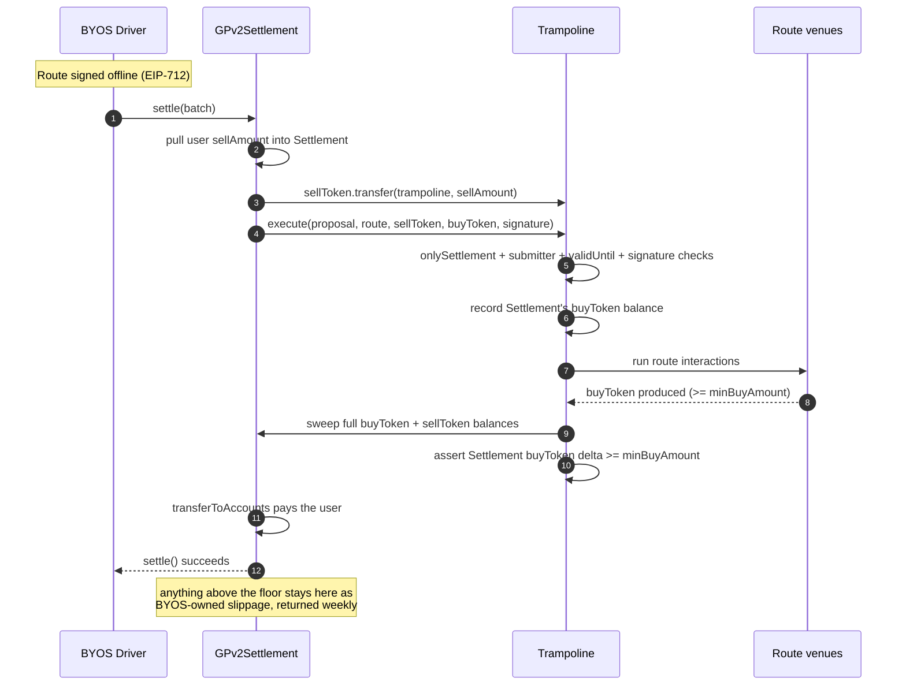
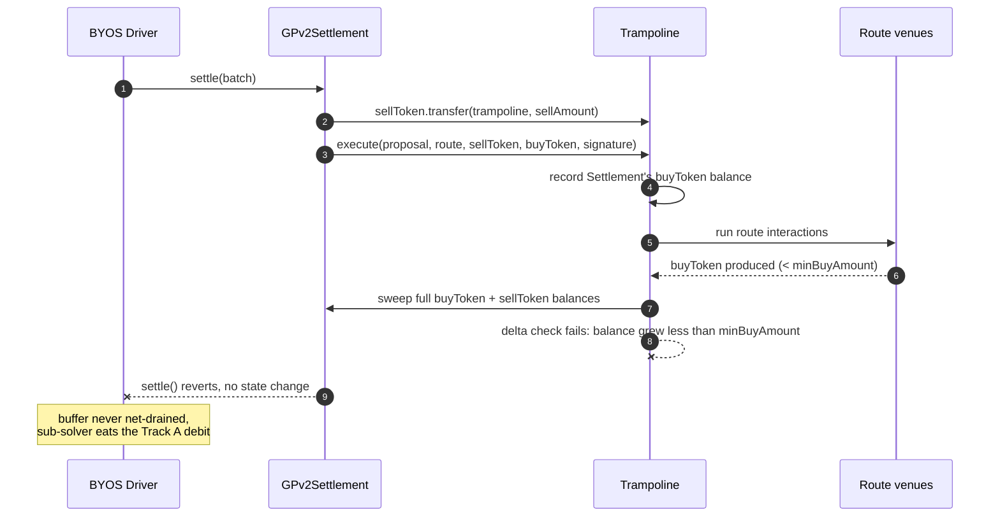
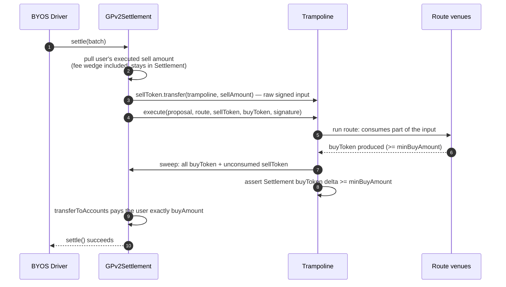
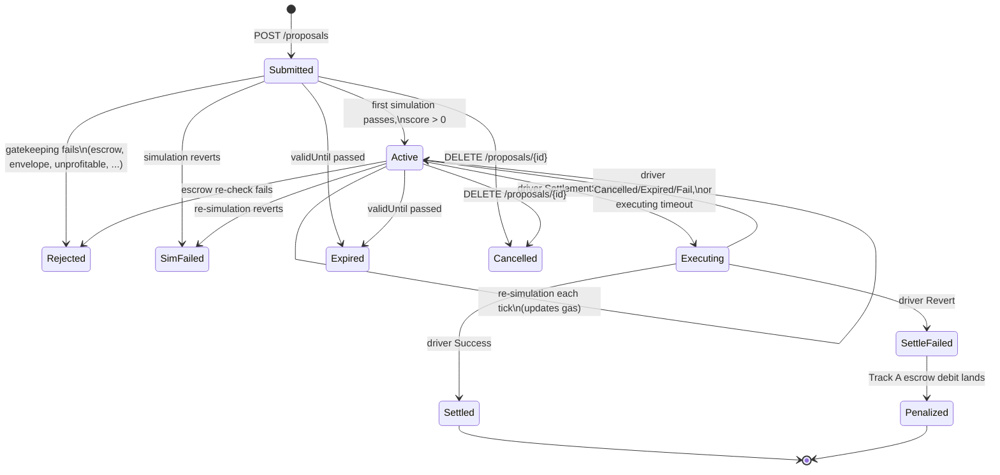

# BYOS design document

The normative specification for BYOS. Where an implementation disagrees with this document, the implementation is wrong — unless this document carries a dated revision note saying otherwise.

Vocabulary is defined once, in [the glossary](glossary). CoW protocol mechanics this design rests on are under [fee collection](reference/cow-fee-collection), [slashing policy](reference/cow-solver-slashing-policy), [auctions](reference/solver-auctions), and [CIPs](reference/solver-cips). Rationale for individual decisions lives with the code, in the ADRs of [`byos-contracts`](https://github.com/bleu/byos-contracts/tree/main/docs/adr) and [`byos-service`](https://github.com/bleu/byos-service/tree/main/docs/adr); those ADRs cite the sections below and do not restate them.

## Citable sections

These anchors are the interface between this document and every ADR that cites it. Treat them as stable: heading text may be reworded only in ways that preserve the anchor, and removing or renaming one is a breaking change that requires updating the citations in all three implementation repos.

| Anchor | Covers |
|---|---|
| [`#overview`](#overview) | What BYOS is, its components, how the protocol sees it |
| [`#order-flow`](#order-flow) | Value flow through a settlement, all three outcomes |
| [`#trampoline`](#trampoline) | The sandbox contract as a whole |
| [`#topology`](#topology) | One instance per sub-solver, CREATE2, deployment timing |
| [`#execution-authority`](#execution-authority) | Who may call `execute`, and what it verifies |
| [`#escrow`](#escrow) | Collateral ledger as a whole |
| [`#escrow-roles`](#escrow-roles) | Owner, operator, submitter |
| [`#withdrawal-and-freeze`](#withdrawal-and-freeze) | Cooldown, all-or-nothing exit, freeze, pause |
| [`#proposal-schema`](#proposal-schema) | The EIP-712 signed struct and domain |
| [`#proposal-api`](#proposal-api) | HTTP surface, authentication, rate limiting |
| [`#proposal-lifecycle`](#proposal-lifecycle) | State machine, simulation, retention |
| [`#solver-engine`](#solver-engine) | Selection, scoring, settlement crafting |
| [`#single-order-solutions`](#single-order-solutions) | One order per proposal, per settlement |
| [`#gas`](#gas) | The gas cut and how CoW fees actually work |
| [`#penalties`](#penalties) | The penalty schedule as a whole |
| [`#track-a`](#track-a) | Revert, deadline, and non-settlement debits |
| [`#post-settlement-buffer-accounting`](#post-settlement-buffer-accounting) | Buffer ledger, threshold clearing |
| [`#track-b`](#track-b) | EBBO and fairness passthrough |
| [`#attribution`](#attribution) | Mapping a settlement back to a sub-solver |
| [`#residue`](#residue) | Surplus custody and stray tokens |

## Implementation status

What is specified here versus what exists today. `n/a` means the section does not constrain that repo.

| Section | byos-contracts | byos-service (Rust) | byos-service-ts |
|---|---|---|---|
| [`#order-flow`](#order-flow) | implemented | implemented | implemented |
| [`#topology`](#topology) | implemented | implemented | implemented |
| [`#execution-authority`](#execution-authority) | implemented | implemented | implemented |
| [`#escrow`](#escrow) | implemented | partial | partial |
| [`#proposal-schema`](#proposal-schema) | implemented | implemented | implemented |
| [`#proposal-api`](#proposal-api) | n/a | implemented | implemented |
| [`#proposal-lifecycle`](#proposal-lifecycle) | n/a | implemented | implemented |
| [`#solver-engine`](#solver-engine) | n/a | implemented | implemented |
| [`#gas`](#gas) | n/a | implemented | implemented |
| [`#penalties`](#penalties) | implemented | partial | partial |
| [`#residue`](#residue) | implemented | n/a | n/a |

Both services are `partial` on escrow and penalties because Track B operations (freeze, unfreeze) are triggered by hand in v1 rather than by an automated flow.

## Overview

BYOS is a bonded CoW solver that does not compute routes. It sells its solver seat as a service: any external party may submit a signed route for a specific order, backed by collateral, and BYOS bids the best one it holds. From the protocol's side nothing is unusual — BYOS is one ordinary bonded solver, and the sub-solver relationship is entirely internal.

### Why BYOS exists

Becoming a CoW solver today is a gated process:

| Requirement | Standard pool (CIP-7) | Reduced pool (CIP-44) |
|---|---|---|
| Capital | $500,000 in stablecoins + 1,500,000 COW | $50,000–$100,000 + 500,000–1,000,000 COW |
| Governance | Deploy a Gnosis Safe with CoW DAO as sole signer | Same Safe requirement |
| Vouching | Vouched by an existing solver or the DAO | Core-team approval required |
| Onboarding | Shadow competition and testing on Sepolia before mainnet access | Same requirement |
| Compliance | KYC through the vouching solver's pool | Same |

An external router that can find good routes has no way to participate without a bonding pool willing to vouch for it and significant locked capital. BYOS drops the barrier to a collateral deposit sized to cover one worst-case revert penalty (`gas + c_l`) and the ability to sign an EIP-712 message and return a route.

### Responsibility split

| | Sub-solver | BYOS |
|---|---|---|
| **Route computation** | Responsible | Not involved |
| **Transaction submission** | Not involved | Responsible (via CoW driver) |
| **Scoring and auction bidding** | Not involved | Responsible |
| **Revenue from own venue fees** | Keeps any fees their route earns at the DEX level (e.g., LP fees on a pool they operate) | Not involved |
| **In-route surplus capture** | May capture surplus inside the route before the sweep ([details](#residue)) | Keeps uncaptured surplus as settlement slippage |
| **Gas cut** | Not charged directly | Retains the estimated gas cost on every settled trade ([details](#gas)) |
| **CoW solver rewards** | None in v1 — no reward pass-through | Retains 100% of CoW rewards earned under its bonded solver seat |
| **Escrow risk** | Bears Track A (revert) and Track B (EBBO) penalties | Absorbs shortfall when escrow is insufficient |

### Components

Three components carry that:

1. **Contracts** — an **Escrow** holding sub-solver collateral, and a per-sub-solver **Trampoline** that executes routes in a fund-less sandbox. Immutable, no proxies, no upgrade keys.
2. **Service** — a proposal API where sub-solvers submit signed routes, a solver engine answering the CoW driver's `/solve`, and background workers for validation, settlement outcomes, and escrow operations.
3. **Policy** — the penalty schedule and attribution model that lets BYOS recover from a sub-solver what CoW charges BYOS.

BYOS requires **no changes to the CoW auction or competition**. It is a black box to the protocol and a vanilla solver engine to the driver, which CoW itself runs under the bonding pool arrangement.

The design problem is that CoW's safety model does not fit. `settle` is `onlySolver`, gated by a manager-curated allowlist; vouched solvers post a bond; a circuit breaker slashes or jails misbehavior. CoW trusts a permissioned, bonded set and punishes them rather than constraining what interactions may do. Sub-solvers are permissionless and unbonded — exactly the actor that model refuses to let near `settle`.

So BYOS rebuilds the boundary structurally rather than socially. The Trampoline replaces the `onlySolver` allowlist with a sandbox. Escrow replaces the DAO bond. Debit and slash replace circuit-breaker slashing.

## Order flow

How a single order moves through `GPv2Settlement` and a sub-solver's Trampoline instance, and how the outcomes differ.

Actors:

- **BYOS driver** — builds and submits the settlement, authoring the funding transfer and the `execute` call. Run by the CoW core team.
- **`GPv2Settlement`** — CoW's settlement contract. Holds funds; runs intra-interactions as itself.
- **Trampoline** — the sub-solver's instance. Fund-less at rest, with no allowance over the settlement.
- **Route venues** — the DEXes the route hits.
- **Sub-solver** — signs the route offline (EIP-712), never executes on-chain.

The funding transfer and `execute` are separate interactions because they run in different `msg.sender` contexts. The transfer-in runs as the settlement, which owns the funds; the route runs as the Trampoline. That split keeps the route from ever holding the settlement's spend authority.

Inside `execute`, the instance records the settlement's buy-token balance, runs the sub-solver's route, sweeps its own full remaining balance of both trade tokens to the settlement, and reverts unless the settlement's buy-token balance grew by at least `minBuyAmount` — the signed floor. The sweep and the check are Trampoline contract code; the sub-solver supplies only the route.

### Happy path

The route produces at least `minBuyAmount` of buy token. The sweep pushes everything the instance holds back to the settlement, the delta check passes, the settlement pays the user, and BYOS's buffer nets to zero. Anything above the floor is not stranded and not sub-solver property: it sits in the settlement as BYOS-owned slippage, returned by CoW's weekly accounting.



A route may also deliver output to the settlement directly instead of to the instance. The delta check measures what the settlement actually received, so both shapes pass.

### Shortfall

The delta check fails and reverts the whole settlement. No trade, and BYOS's buffer is untouched. Below `minBuyAmount` nothing settles: the guard is an explicit assertion on the settlement's balance growth, so it also catches routes that deliver output somewhere other than the settlement.



### Buy orders

Same mechanism, different slack. A buy order fixes the user's output, so the input is over-provisioned: the full signed `sellAmount` is pushed in, the route consumes only what it needs, and the sweep returns the unconsumed sell token to the settlement along with the output. The delta check is identical — the settlement's buy-token balance must grow by at least the floor. For a buy order, `minBuyAmount` must equal `quoteBuyAmount` and must equal `order.buyAmount`.



Nothing above is specific to an order kind. For either kind the instance receives the signed `sellAmount`, runs the route, sweeps both trade tokens, and `execute` asserts the same buy-token delta floor. What changes is which amount the user fixed, and therefore where the slack shows up:

| | Sell order | Buy order |
|---|---|---|
| User fixes | `sellAmount`; the route normally consumes all of it | `buyAmount`, the exact amount owed to the user |
| Floor means | the minimum output the sub-solver commits to deliver | at least the user's exact `buyAmount` (`minBuyAmount == quoteBuyAmount`) |
| Typical leftover | buy-token over-delivery above the floor | unconsumed sell token, returned by the sweep |

The mechanism also covers same-token hook orders (`sellToken == buyToken`, always with `sellAmount > buyAmount`), where the user submits the order mainly to run hooks and the difference funds them. The delta check stays sound because the snapshot is taken after the funding transfer has already left `GPv2Settlement`: the sweep returning the unconsumed input is the delivery it measures, and the floor still guarantees the settlement is never net-drained. The shared token is swept once, and `execute` must not reject equal addresses.

### The outcomes at a glance

| Route delivery vs floor | Delta check | Settlement | Extras (surplus, unconsumed input) |
| --- | --- | --- | --- |
| Exactly the floor | passes | succeeds | none |
| Above the floor | passes | succeeds | swept to the settlement; BYOS-owned slippage, returned weekly |
| Below the floor | reverts | reverts | none — no trade |

### Floor and ceiling: `minBuyAmount` and `quoteBuyAmount`

The proposal carries two signed buy-amount fields. `minBuyAmount` is the floor — the hard revert threshold the delta check enforces on-chain. `quoteBuyAmount` is the ceiling — the clearing-price commitment BYOS uses for scoring, gas-cut sizing, and settlement encoding. When `minBuyAmount` equals `quoteBuyAmount`, the behavior is the same as a fixed-amount proposal.

**Sell orders.** `sellAmount` equals the order's sell amount. When a sub-solver sets `minBuyAmount` lower than `quoteBuyAmount`, the sub-solver opts into loose slippage. The delta check enforces `minBuyAmount`. The clearing price uses `quoteBuyAmount`. The validation envelope enforces `order.buyAmount <= minBuyAmount <= quoteBuyAmount`.

After a successful settlement, if the route delivered less than `quoteBuyAmount`, the difference is charged against the sub-solver's escrow. This is not a penalty — it mirrors how CoW charges BYOS for the same gap. The difference `quoteBuyAmount − delta` is converted to native token at the auction's reference price and debited from escrow. If the route over-delivers (`delta > quoteBuyAmount`), the over-delivery is recorded as a credit that offsets future shortfalls but is never paid out.

**Buy orders.** The same struct fields exist, but loose slippage does not apply. In a sell order the sub-solver promises to deliver tokens. In a buy order the promise is to consume fewer tokens. BYOS has no mechanism to source the extra tokens (those not priced into the clearing price) for the sub-solver. A sub-solver who wants loose slippage on buy orders must pre-fund their Trampoline instance with buffer tokens. The validation envelope hard-rejects any buy-order proposal where `minBuyAmount != quoteBuyAmount`.

**Partially fillable orders** follow the same rules. The envelope validates `minBuyAmount` and `quoteBuyAmount` against the proportionally scaled limit price.

Where the fee wedge sits for each order kind, with worked numbers, is in [`reference/cow-fee-collection`](reference/cow-fee-collection) and summarized under [`#gas`](#gas).

## Trampoline

### Topology

**One Trampoline instance per sub-solver address.** Instances live at a deterministic CREATE2 address keyed by the sub-solver address recovered from the proposal's EIP-712 signature. Counterfactual, no registry, no governance step: the address is computed, not tracked.

A Trampoline is needed at all because in `GPv2Settlement.settle`, every interaction executes as a bare `call` from the settlement contract. `msg.sender` is `GPv2Settlement`, which holds all buffers and can be made to grant any approval; the only target it hard-blocks is the vault relayer. Permissionless sub-solver code must never run in that context. The Trampoline re-runs the interactions as itself, in a fund-less context.

Containment is structural, not filtered. A recognize-and-block approve filter cannot carry the boundary, because "grant an allowance" has shapes a filter misses — `Permit2.approve` uses a different target and selector yet still grants a drainable allowance on a real token. What a sub-solver cannot get around is a contract that holds no funds and where each sub-solver reaches only its own instance.

Topology governs what happens to persistent state. Because the Trampoline runs sub-solver-authored calls as itself, it grants ERC-20 approvals to sub-solver-chosen targets and may retain dust. An exploit needs both a planted approval and a resting balance, and an approval over an empty contract drains nothing.

**The instance ends every settlement holding none of the trade tokens.** That post-condition is the leak-prevention control, and it is enforced by contract code:

1. `GPv2Settlement` transfers exactly `sellAmount` of `sellToken` into the instance.
2. The instance runs the sub-solver interactions.
3. The instance sweeps its full remaining balance of both trade tokens back to `GPv2Settlement`.
4. `execute` reverts unless the settlement's buy-token balance grew by at least `minBuyAmount`.

Approvals are not reset to zero. The enforced invariant is zero balance at rest rather than zero approvals, because approvals are per-`(token, spender)` over an unbounded, sub-solver-authored set and cannot be generically enumerated to reset, whereas balance is directly assertable. With the instance fund-less at rest and isolated per sub-solver, a standing or over-broad approval drains nothing belonging to the protocol or another sub-solver. BYOS-encoded approvals to known routers may be left standing and reused across that sub-solver's future settlements. Failed settlements revert atomically, rolling back any approval set in the attempt.

As defense in depth, BYOS authors the approvals itself: exact `sellAmount`, route-derived, granted only to the venues the route uses, and it rejects obvious sub-solver-authored approve-like calls at gatekeeping. This is best-effort by design, since "approve-like" is not one selector, and per-instance isolation plus the sweep remains the backstop.

Native ETH follows the same rule. The instance performs any required WETH wrap or unwrap internally, within the single settlement, and any ETH balance remaining afterwards is swept back or the settlement reverts.

**Deployment happens at escrow-deposit time, paid by the sub-solver.** `Escrow.deposit()` triggers the factory's idempotent `ensureDeployed` for the credited sub-solver. Settlements assume the instance exists; there is no on-chain existence guard in the hot path. Since the API is permissionless but collateral-gated, no escrow deposit means no valid proposal, so a valid proposal implies a deployed trampoline. The only residual is a reorg of the deposit transaction, handled as an infra failure ([`#track-a`](#track-a)).

Per-instance isolation earns its keep on three things a shared trampoline cannot offer: it confines any un-sweepable residual to its originating sub-solver, it permits safe approval reuse for gas, and it gives on-chain attribution ([`#attribution`](#attribution)).

### Execution authority

`execute` is callable only when all of the following hold:

- `msg.sender == GPv2Settlement` — a settlement context.
- `tx.origin` holds the Escrow's `SUBMITTER_ROLE` — a settlement submitted by BYOS.
- The sub-solver's EIP-712 signature over the route verifies, and `validUntil` has not passed.

**Signature-gating** exists so a reverted settlement self-evidences exactly what the sub-solver authorized: the signed data is in the calldata, recoverable from the transaction. This makes Track A debits verifiable by any third party rather than only by BYOS. Without it, BYOS could substitute different interactions, submit a settlement that reverts, and debit the sub-solver for a fault it manufactured.

**The submitter gate** exists because once BYOS settles a proposal, its signature and route are public calldata. While `validUntil` is live, any other allow-listed CoW solver could replay or front-run the `execute` in its own settlement, rerunning the signed route outside BYOS's control and muddying attribution. `SUBMITTER_ROLE` is granted by the Owner on the Escrow, which therefore acts as the submitter registry for its contract generation. It covers both the allow-listed solver EOA and, for CoW's `Solver7702Delegate` parallel path, each approved auxiliary account — there the auxiliary account, not the solver EOA, is `tx.origin`.

Rotation is a `grantRole` or `revokeRole` call on the Escrow, not a redeploy. The submitter set must stay in sync with the 7702 delegate's approved callers: those are immutable constructor arguments, so rotating an auxiliary key means a new delegate deploy, a fresh EIP-7702 authorization, and matching role changes. An auxiliary account missing its grant fails settlements at the Trampoline; it does not create risk.

The instances are therefore not dependency-free: `execute` performs two staticcalls into the Escrow per settlement. A compromised Owner could block settlements by revoking all submitters, which is no worse than the pre-existing Owner trust.

## Escrow

A per-chain, native-token **ERC20 contract** holding sub-solver collateral keyed by sub-solver address. Tokens are minted 1:1 with deposited ETH and burned on withdrawal or debit. `balanceOf` is the single source of truth, with the invariant `totalSupply() + accumulatedDebits == address(this).balance`.

Anyone may deposit for a sub-solver. The sub-solver withdraws subject to a cooldown. BYOS holds an exclusive debit function. This collateral is the *only* sub-solver capital BYOS touches — trade capital flows atomically through `GPv2Settlement` into the Trampoline and back.

**Authorization is blanket, not per-proposal.** Depositing grants BYOS standing debit authority up to the sub-solver's balance. On-chain EIP-712 verification per debit was rejected: it adds gas and complexity for marginal benefit, since the operator is already a trusted role and sub-solvers have an off-chain relationship with BYOS.

The contract is a **dumb ledger**. It enforces bounds — who may debit, cooldown, pause, freeze, transfer restrictions — but never the correctness of a debit's reason. Reserve calculations, proposal eligibility, and transfer-chain debit caps live in the service.

**Deployment is immutable.** No proxy, no upgrade key. A v2 means a new deployment. The Escrow's constructor deploys the Trampoline factory itself, taking the `GPv2Settlement` address rather than a factory address: instances bind to the Escrow as their submitter registry, and the factory needs the Escrow address before the Escrow could otherwise exist. Escrow, factory, and EIP-712 domain therefore form one deployment generation.

### Escrow roles

- **Owner** — a secure wallet, multisig or Safe. Sets the operator, configures the cooldown, grants and revokes `SUBMITTER_ROLE`, transfers ownership, and receives all debited funds. Ownership transfer is two-step (`transferOwnership` then `acceptOwnership` by the nominee) so an address typo cannot brick the contract.
- **Operator** — an EOA living in the BYOS service, for automated operation: `debit`, `freeze`, `unfreeze`, `pause`, `unpause`. Cannot withdraw funds or change configuration.
- **Submitter** (`SUBMITTER_ROLE`) — the EOAs the service submits settlements from. Holds no escrow authority at all; the role exists only because `Trampoline.execute` gates on `tx.origin` ([`#execution-authority`](#execution-authority)).

The operator's key is the exposed one, since it lives in the service. If it is compromised, the attacker can debit sub-solver balances, but those funds go to the Owner, not the attacker, and the Owner can replace the operator immediately. That bounds a key compromise to griefing rather than theft. Granting submitters is deliberately Owner-only: giving the operator that power would let a compromised operator authorize a rogue submitter, pass the Trampoline's gate, and replay signed routes.

`withdrawDebits()` is callable by anyone, and funds always go to the Owner address. That allows automated sweeping by keepers or the service without the Owner's cold wallet signing.

### Withdrawal and freeze

Withdrawal is **all-or-nothing with a cooldown**:

- `requestWithdrawal()` — the sub-solver signals intent to withdraw the entire balance. Effective balance drops to zero immediately, so the sub-solver is offline for new proposals. The cooldown clock starts.
- `executeWithdrawal()` — after the cooldown expires, the full remaining balance is withdrawn. No partial withdrawals.
- `cancelWithdrawal()` — aborts the request, effective balance restores. Callable regardless of freeze state, since funds staying in the contract is always safe.

All-or-nothing eliminates balance fragmentation and the withdraw-after-known-revert race. A sub-solver reducing its position does a full cycle.

**Freeze** is per-address, operator-controlled, and blocks withdrawal execution and ERC20 transfers in both directions while a Track B investigation is open. It does not affect effective balance — reserve logic is a service concern. Deposits to a frozen address are allowed, so collateral can be topped up during an investigation. A pending withdrawal request survives a freeze: after unfreeze the sub-solver can execute immediately, with the cooldown already served. There is no on-chain freeze timeout or dispute mechanism; the Owner can replace an unresponsive operator.

**Pause** is global and operator-triggered, blocking all transfers and withdrawal executions. Every token movement flows through the ERC20 `_update` hook:

| | Paused | Sender frozen | Receiver frozen | Sender withdrawing | Receiver withdrawing |
|---|---|---|---|---|---|
| Transfer | blocked | blocked | blocked | blocked | blocked |
| Mint | allowed | n/a | allowed | n/a | blocked |
| Burn | no restriction | no restriction | n/a | no restriction | n/a |

Burns carry no `_update` restriction because the calling function enforces its own access control: `debit` must work during a pause and against frozen addresses so the operator can act during an incident, while `executeWithdrawal` independently checks not-frozen, not-paused, and cooldown-elapsed.

The incident response flow is: pause, trace tainted addresses through `Transfer` event history, freeze each identified address, unpause so legitimate sub-solvers resume, then debit the frozen addresses at leisure. The pause window should be minutes. Deposits stay open throughout.

**Transfers exist for key rotation.** A sub-solver calls `transfer(newAddress, fullBalance)`; BYOS detects it, updates its mapping, and a new Trampoline is deployed for the recipient (both transfer functions call `ensureDeployed`). This avoids the uncollateralized gap a withdraw-and-redeposit cycle would open. The security cost is that transfers enable debit evasion, mitigated by pause, freeze, and off-chain tracing: when `debit(A, amount)` hits an insufficient balance, the service traces A's outbound `Transfer` events and debits recipients up to what they received from A. That cap is enforced off-chain; the operator's blanket authority is unchanged. A consequence worth naming: a malicious sub-solver can send tokens to an innocent address and make it a debit target.

The token is deliberately transfer-restricted and will not integrate with DeFi protocols. It represents escrowed collateral, not a tradeable asset.

**Reserve and FX policy is off-chain.** There is no on-chain reserve multiplier. For Track B, the service converts the claim amount to a native-token equivalent via CoW's quote API, the operator debits that amount, and the service tracks a 5× reserve off-chain against pending claims, reducing the sub-solver's service-level effective balance. That buffer covers token appreciation over an investigation window of up to three months; beyond 5×, BYOS absorbs the tail. The multiplier is a service parameter, tunable without a contract change.

There are **no on-chain dispute mechanisms** — no per-debit caps, no freeze timeouts, no challenge windows. Disputes are handled off-chain ([`#penalties`](#penalties)).

### Escrow interface

The authoritative signatures and natspec live in [`src/interfaces/`](https://github.com/bleu/byos-contracts/tree/main/src/interfaces) in the contracts repo. The shape:

```solidity
// Owner-only
function setOperator(address newOperator) external;
function setCooldownPeriod(uint256 period) external;
function transferOwnership(address newOwner) external;
function acceptOwnership() external;         // only the pendingOwner

// Operator-only
function debit(address subSolver, uint256 amount, bytes32 reason) external;
function freeze(address subSolver) external;
function unfreeze(address subSolver) external;
function pause() external;
function unpause() external;

// Sub-solver
function requestWithdrawal() external;
function executeWithdrawal() external;
function cancelWithdrawal() external;

// Anyone
function deposit(address subSolver) external payable;   // also ensures the Trampoline exists
function withdrawDebits() external;                     // always pays the Owner

// Views
function balanceOf(address subSolver) external view returns (uint256);
function effectiveBalance(address subSolver) external view returns (uint256);
function withdrawableBalance() external view returns (uint256);
```

`effectiveBalance(S)` is zero when a withdrawal is pending, otherwise `balanceOf(S)`. Freeze does not affect it. `withdrawableBalance()` is the accumulated debit pool available to the Owner.

Events are the audit trail and the public record of every penalty action: `Deposited`, `Debited`, `Withdrawn`, `Frozen`, `Unfrozen`, `OperatorUpdated`, `DebitsWithdrawn`, `WithdrawalRequested`, `WithdrawalCancelled`, `CooldownPeriodUpdated`, plus the two ownership-transfer events. On-chain state is kept minimal by design; cumulative history comes from events.

## Proposal schema

The EIP-712 typed data a sub-solver signs. This struct is verified twice: by the service at ingestion, and on-chain by the Trampoline at settlement. What the service accepts is therefore exactly what the sub-solver consented to execute.

```solidity
struct ProposalData {
    bytes32 orderUidHash;      // keccak256(order_uid) — ties to a specific order
    uint256 sellAmount;        // route consumption the instance receives (raw, pre-fee)
    uint256 minBuyAmount;      // floor: minimum buy-token delta the contract enforces on-chain
    uint256 quoteBuyAmount;      // ceiling: clearing-price commitment used for scoring and settlement encoding
    bytes32 interactionsHash;  // keccak256(abi.encode(interactions)) — the route
    uint256 validUntil;        // expiry timestamp
    uint256 nonce;             // unique salt for signature uniqueness
}
```

```solidity
Eip712Domain {
    name: "BYOS",
    version: "0.1",
    chainId: <chain_id>,
    verifyingContract: <trampoline_factory_address>
}
```

**Amounts are raw pre-fee quotes.** `sellAmount` is the route's consumption; the fee wedge the user pays on top stays in the settlement and is never forwarded. `minBuyAmount` is the on-chain floor, enforced by the balance-delta check ([`#order-flow`](#order-flow)). `quoteBuyAmount` is the clearing-price commitment — the amount BYOS uses for scoring, gas-cut sizing, and settlement encoding. When both are equal, the behavior is a fixed-amount proposal. When `minBuyAmount` is lower, the sub-solver opts into loose slippage on sell orders ([`#order-flow`](#order-flow)). Disputes compare on-chain outcomes against the signed amounts after applying the driver's deterministic fee shift ([`#gas`](#gas)).

**`interactionsHash` is required.** Without it, BYOS could substitute different interactions while presenting the same signed amounts, then blame the sub-solver for the resulting revert. The Trampoline verifies `keccak256(abi.encode(interactions)) == interactionsHash` before executing, so substituted interactions fail signature verification. This differs from CoW order signatures, which do not sign interactions, because the threat model is inverted: sub-solvers need protection against the operator, not against the execution path.

**There is no `escrow_account` field.** The recovered signer address *is* the escrow key, and the Trampoline CREATE2 salt. One address is load-bearing three ways. Delegation — sign with key K, collateral from account E — would complicate the Escrow's dumb-ledger design and is a v2 concern. A sub-solver running multiple strategies deposits separately per address. Key rotation moves collateral by ERC20 transfer ([`#withdrawal-and-freeze`](#withdrawal-and-freeze)) and gets a new Trampoline instance.

**The nonce is a unique salt, enforced on-chain.** Each Trampoline instance tracks used nonces in a `mapping(uint256 => bool)`. Any `uint256` is valid as long as it has not been consumed; there is no ordering rule. On-chain nonce enforcement provides hard replay protection independent of BYOS trust, at the cost of 20k gas for the first use of each nonce. Fill tracking alone would not prevent replay of `execute`, since a settlement need not include the order at all, so a third party could rerun a live proposal in a tradeless settlement. Third-party replay is additionally blocked by the submitter gate ([`#execution-authority`](#execution-authority)). Replay by BYOS's own submitter is prevented by the nonce check; `validUntil` further bounds the window.

**The payload is raw interactions**, `Vec<{target, value, calldata}>` — arbitrary calls against any DEX or protocol, executed as-is. Structured routes would let BYOS author every call and forbid sub-solver approvals outright, but they would kill any-DEX generality and require BYOS to maintain a venue registry. Containment is the Trampoline's job, structurally. The sub-solver is fully responsible for the complete route, including required hooks and approvals; BYOS can accept or reject at gatekeeping, never patch.

The **factory is a domain anchor**. Binding `verifyingContract` to the TrampolineFactory cleanly separates contract generations: v1 signatures do not verify against a v2 factory. A factory redeployment invalidates all outstanding signatures, so sub-solver clients must update their domain configuration.

## Proposal API

The public HTTP surface by which sub-solvers submit signed proposals. Field-level types, status codes, and error shapes are specified in [`crates/byos/openapi.yml`](https://github.com/bleu/byos-service/blob/main/crates/byos/openapi.yml) in the service repo, which is the authority for the wire contract; this section specifies its semantics.

| Endpoint | Purpose |
|---|---|
| `POST /proposals` | Submit a signed proposal. Answers `202 Accepted` with an id. |
| `GET /proposal/{id}` | The caller's own proposal, including status and any rejection reason. |
| `GET /proposals/{order_uid}` | The caller's own proposals on that order. |
| `GET /proposals/by-sub-solver` | All of the caller's proposals. |
| `GET /buffer-balance` | The caller's outstanding buffer balance, clearing threshold, and per-proposal entries. |
| `DELETE /proposal/{id}` | Cancellation by the original signer. |

`POST` does not carry token addresses. The orderbook order is the single source of truth for them, which removes a lying-client hazard.

**The recovered signer is the identity.** There are no API keys, sessions, or accounts. Callers are sub-solver servers over TLS, not browsers.

**Every read is authenticated and owner-scoped.** GET endpoints require an EIP-712 signature in the `X-Signature` header, and the recovered signer scopes the response — competitors' proposals are invisible, and even "which addresses are competing on which order" does not leak. The signed message is a dedicated type owned by the service and never verified on-chain:

```solidity
struct ReadAuth {
    uint256 version;  // pinned to 1
}
```

It is a bearer signature: signed once, sent on every request, with no timestamp, nonce, or path binding. The blast radius of a leak is read access to the signer's own proposals — no writes, no cancellation, no funds — and a distinct typehash prevents replaying it as a submission or cancellation. A timestamp window would make external teams' clock drift a support burden; a nonce set would be the first per-signer auth state in the service. `version` exists because EIP-712 structs need at least one field, and bumping it invalidates all outstanding read tokens.

**Non-owners get 404, not 403**, on both `GET /proposal/{id}` and `DELETE`. A 403 would be an existence oracle: anyone could probe ids and learn how many proposals are live. The ownership check runs before the liveness check, so `DELETE`'s 409 for an already-terminal proposal is only ever seen by the owner.

**Cancellation is signed, by server-assigned id**, using another service-owned type in the same domain:

```solidity
struct CancelProposal {
    uint256 proposalId;
}
```

Proposals are immutable, so there is no update operation and no `PUT`. Replacement is a new `POST`, optionally preceded by a `DELETE`.

**Ingestion is asynchronous.** The request path does three things inline: parse, `ecrecover`, and check the expiry window. On success the proposal is stored as `Submitted` and answered `202` — meaning "accepted for validation", not "accepted". Signature and expiry-window failures reject synchronously with a typed 4xx, since there is no point storing and auditing a proposal that is dead on arrival. All on-chain work, the escrow balance check and simulation, runs in a background validator loop ([`#proposal-lifecycle`](#proposal-lifecycle)). Sub-solvers poll for the verdict, and a rejection carries a machine-readable typed reason.

That means a `2xx` from `POST` is not acceptance. Integration code that treats it as acceptance is wrong. Verdict latency is bounded by the validator tick interval, not by the request round-trip.

**Rate limiting is two-layer and escrow-tiered.** A coarse per-IP limit sheds floods before any cryptography; a per-signer limit applies after `ecrecover`, scaled by escrow balance tier, and a signer known to be below the minimum escrow is rejected once a balance is known. That rejection applies to submission only: effective escrow balance reads as zero from the moment a sub-solver requests a withdrawal, so gating reads and cancellations too would leave a sub-solver winding down unable to cancel, or even see, the proposals it still has live. An address the service has not seen before is admitted at the lowest tier rather than rejected, since absence of a cached balance is not evidence of an empty one. The escrow balance behind the second layer is cached so the request path does no RPC. The two limits are operational tuning parameters; what this document fixes is the two-layer structure. Well-capitalized sub-solvers get higher throughput, which is consistent with the collateral-gated permission model.

The reject-early pipeline, split across the sync and async boundary:

| # | Stage | Where |
|---|---|---|
| 1 | IP filter | edge (CDN), with a loose in-app backstop |
| 2 | Parse + `ecrecover` | request path |
| 3 | Expiry-window check | request path |
| 4 | Signer rate limit | request path |
| 5 | Cached escrow floor gate (submission only) | request path |
| 6 | Authoritative escrow balance check (RPC) | background validator |
| 7 | Gatekeeping + simulation | background validator |

Stage 1 sits at the edge because a request rejected there costs no socket, no `ecrecover`, and no connection-pool slot. That depends on the origin being unreachable except through the CDN; otherwise the forwarded client-IP header is attacker-controlled and anything keyed on it is poisoned. The in-app backstop defends against that misconfiguration, not against an attacker who beat the edge.

**Two listeners, one process.** A public port serves `/proposals`; a firewalled internal port serves `/solve` and `/notify`. They never share a socket, because their trust boundaries are opposite: the proposal API must be internet-reachable, while a `/solve` response is the full standing proposal book for an auction — amounts, routes, and signatures, all MEV-relevant. Origin is enforced by network topology rather than path obscurity; an optional bearer token on `/solve` is defense in depth, not a replacement. The split also prevents public traffic from starving the latency-critical path.

**Persistence is Postgres, in two tables with different jobs.** The `proposals` table holds what *is* — current state, single source of truth, read and written by `GET`, `/solve`, `/notify`, and the validator. The append-only `audit_events` table holds what *happened*, written behind an unbounded channel by a separate task, and is the dispute evidence for Track B claims that arrive up to three months later. Emission is in the store by construction, so a new mutation path cannot forget to leave evidence. The service refuses to start without a reachable database and applied migrations, retries forever during a runtime outage, and drains the queue on shutdown. There is no deletion path for the audit log.

The write-behind leaves a small crash window: an audit event is emitted only after its proposal write commits, so a crash between the two leaves a durable state change with no matching event. Closing it would couple every store write to the audit codec and remove the writer's retry isolation. Accepted, at one event per crash.

## Proposal lifecycle

### States



A state answers exactly one question: what does the service do with this proposal right now?

| State | Simulated | Offered to `/solve` | Expiry sweep | Cancellable | Retention |
|---|---|---|---|---|---|
| `Submitted` | first pass | no | yes | yes | live |
| `Active` | every tick | yes | yes | yes | live |
| `Executing` | no | no | no | no | live |
| `Rejected` | no | no | — | no | 1 hour |
| `SimFailed` | no | no | — | no | 1 hour |
| `Expired` | no | no | — | no | 1 hour |
| `Cancelled` | no | no | — | no | 1 hour |
| `Settled` | no | no | — | no | indefinite |
| `SettleFailed` | no | no | — | no | indefinite |
| `Penalized` | no | no | — | no | indefinite |

Every transition:

| From | To | Trigger |
|---|---|---|
| — | `Submitted` | `POST /proposals`: signature verified, expiry window OK. |
| `Submitted` | `Active` | First validation passes: escrow check, envelope check, simulation succeeds, score > 0. Writes gas, trampoline address, token addresses. |
| `Submitted` | `Rejected` | A gatekeeping rule fails: insufficient escrow, unsupported order, amount mismatch, order not found, or unprofitable. Carries the typed reason. |
| `Submitted` | `SimFailed` | First simulation reverts. |
| `Active` | `Active` | Re-validation tick refreshes the gas estimate. No status change, no audit event. |
| `Active` | `Rejected` | Escrow re-check fails; the balance dropped below the threshold. |
| `Active` | `SimFailed` | Re-simulation reverts: the order filled or expired on-chain, the route broke, balances moved. |
| `Submitted`, `Active` | `Expired` | `validUntil` is behind the clock. |
| `Submitted`, `Active` | `Cancelled` | Signed `DELETE` by the owner. `DELETE` against any other state is a 409. |
| `Active` | `Executing` | Driver `SettlementStarted`: our solution won and the transaction is being submitted. |
| `Executing` | `Settled` | Driver `Success`. Transaction hash recorded. |
| `Executing` | `SettleFailed` | Driver `Revert`. Transaction hash recorded; the Track A debit follows. |
| `Executing` | `Active` | Driver `Cancelled`, `Expired`, or `Fail` (submission abandoned, no transaction landed), or the executing timeout elapsed. Queues the non-settlement debit. |
| `SettleFailed` | `Penalized` | The Track A escrow debit lands on-chain. Penalty transaction hash recorded. |

**Losing an auction is not a state.** A proposal outscored internally, or whose solution lost the external competition, is still valid and keeps competing. Participation is recorded as data, so "which auctions did this compete in and lose" is a query, not a status. Winning *is* a state change, because it changes what the service does: it must stop offering the proposal and stop re-simulating it.

`Executing` is entered on `SettlementStarted`, not at `/solve` time, because at `/solve` time we do not yet know we won. It is exempt from the expiry sweep on purpose — the chain enforces the order's real deadline. Two safety properties make the state recoverable: `Executing` to `Active` is always safe, because if the order was actually consumed the next re-simulation reverts and the proposal dies; and an executing timeout returns a stuck proposal to `Active`, covering lost notifications and restarts mid-settlement. Re-simulation is the truth-teller.

Transitions are compare-and-swap. Zero rows affected means the caller's verdict was stale, because a cancellation or a notification won the race.

**Terminal retention has one knob.** Rejected, sim-failed, expired, and cancelled rows are deleted an hour after reaching the state; consumers are polling loops that observe a terminal state within one interval, and after that the proposal is a 404. The money states — settled, settle-failed, penalized — are kept indefinitely, with no sweep code at all. `audit_events` has no deletion path.

### Settlement outcomes

Outcomes come from the stock CoW driver's `/notify` protocol. There is no chain watcher and no driver fork.

| Notification | Effect |
|---|---|
| `SettlementStarted` | `Active` to `Executing` |
| `Success { transaction }` | `Executing` to `Settled` |
| `Revert { transaction }` | `Executing` to `SettleFailed`; Track A trigger |
| `Cancelled`, `Expired`, `Fail` | `Executing` to `Active`; queues the non-settlement debit |
| Pre-submission kinds | no transition; recorded as audit events |

Notifications carry auction and solution ids, not proposals, so `/solve` records the `(auction_id, solution_id, proposal_id)` mapping synchronously before returning a solution — if it cannot be recorded, it is not bid. `/notify` joins through that mapping, which doubles as the per-auction participation record. The ids are optional on the wire, so the handler must tolerate notifications it cannot join, but an *outcome* notification that cannot be attributed is an alert-worthy bug.

The driver knows the transaction hash and whether it reverted, but not what it cost. BYOS makes one `eth_getTransactionReceipt` call on a reverted hash to read the real gas used and gas price. That read is how the debit amount is obtained, not a double-check.

This covers cases a block scanner would miss, including private submissions and dropped transactions, and missed-deadline detection comes free from `Expired` and `Cancelled`. A lost `Revert` notification costs that settlement's Track A debit unless recovered by hand from the audit trail and the chain.

### Simulation

Each proposal is simulated as the transaction the driver would actually submit: a real `settle()` on `GPv2Settlement` carrying the real order, via `eth_estimateGas` so the success verdict and the gas figure come from one RPC call.

```
eth_estimateGas:
  from: 0x1111...1111 (dummy submitter)
  to:   GPv2Settlement
  data: settle(
          tokens         = [sellToken, buyToken],
          clearingPrices = [proposal.quoteBuyAmount, proposal.sellAmount],
          trades         = [the real order: fields and signature from the orderbook],
          interactions   = [[], [sellToken.transfer(trampoline, sellAmount),
                                 trampoline.execute(...)], []]
        )
state overrides:
  authenticator -> code: AnyoneAuthenticator
  escrow        -> state_diff: hasRole(SUBMITTER_ROLE, dummy) = true
```

Because the order is real, the user has genuinely approved the vault relayer and holds the sell tokens. No balance faking, no allowance faking, no per-token storage-slot detection. Everything runs at real addresses, so the floor-and-sweep semantics behave exactly as in production and GPv2's own checks — order signature, limit price, `validTo`, filled amount — come along for free. The two overrides stand in only for permissions the dummy sender lacks, and both become unnecessary once a production submitter address holds the role on-chain.

The simulation does not model three calldata words: the encoder fixes the executed amount at the full order amount and the clearing prices at the raw proposal amounts, while the real transaction subtracts the gas cut and substitutes the driver's own per-trade prices, then applies protocol fees. The gas is the same — same tokens, same interactions, same trade, same storage touched — and the divergence is one-directional, since the real transaction pays the user less than the simulated one, never more. A proposal that simulates successfully therefore cannot fail the settlement's limit check because of the cut.

Order data is fetched once from the CoW orderbook and cached for the process lifetime, since orders are immutable after placement. An off-chain soft-cancel is invisible to the service; the proposal's own `validUntil` bounds the window and the driver re-validates at settlement time, so nothing wrong can land on-chain.

Before simulating, the order and proposal pair must pass a cheap envelope check with no RPC:

- No bridging orders.
- `erc20` balance flavors only; external and internal balance orders are rejected.
- Amounts consistent with the order kind:
  - **Sell order (fill-or-kill):** `proposal.sellAmount == order.sellAmount`. The buy-amount envelope enforces `order.buyAmount <= proposal.minBuyAmount <= proposal.quoteBuyAmount`, and `proposal.quoteBuyAmount` must beat the order's limit price.
  - **Buy order (fill-or-kill):** `proposal.minBuyAmount == proposal.quoteBuyAmount == order.buyAmount`. A buy-order proposal where `minBuyAmount != quoteBuyAmount` is hard-rejected — loose slippage does not apply to buy orders ([`#order-flow`](#order-flow)).
  - **Partially fillable (sell):** `0 < proposal.sellAmount <= order.sellAmount`. The limit-price check and the `order.buyAmount <= minBuyAmount <= quoteBuyAmount` constraint apply against proportionally scaled amounts.
  - **Partially fillable (buy):** `proposal.minBuyAmount == proposal.quoteBuyAmount`. The limit-price check applies against scaled amounts.

All four signature schemes are supported, since the scheme is encoded in the trade flags and GPv2 verifies it for real during simulation. Sell and buy orders are both supported, including native-ETH buys. Order hooks are included in the simulation for accurate gas, using the order's pre-encoded interactions from the orderbook; the `/solve` response does not include hooks, because the driver appends the order's own hooks itself.

**A revert is terminal on the first occurrence.** No strikes, no retry. A proposal that reverted once is not offered to `/solve` — if it won and then reverted on-chain, the sub-solver takes a Track A penalty. Transport errors are different: an RPC timeout or DNS failure defers to the next tick rather than punishing the sub-solver, and orderbook 404s reject while transient orderbook errors defer.

**The profitability gate runs on the first simulation only.** A score of zero or less rejects as unprofitable, matching `/solve`'s own inclusion rule, so one invariant holds: an `Active` proposal is one that could win an auction right now. It is not re-applied on re-validation, because gas prices wobble and rejecting on a spike would churn proposals that are profitable again two blocks later.

**Proposal lifetime is capped at ingestion.** `validUntil` more than the configured maximum in the future is rejected, which bounds worst-case simulation cost per proposal and guarantees the expiry sweep arrives. Sub-solvers already run polling loops, and a route priced longer ago than that is stale anyway. The order's own `validTo` needs no separate handling: once the order expires or fills, simulation reverts and first-revert-terminal cleans up within a tick.

Re-simulation runs every tick for `Submitted` and `Active` proposals, at an interval targeting about one block. `Executing` proposals are not simulated. This is deliberately not every-block simulation of everything; the driver's own post-encoding re-simulation catches proposals that go stale in between.

## Solver engine

BYOS is the **solver engine** half of a standard CoW driver and solver pair. The driver — unmodified, run by CoW — handles encoding, gas simulation, scoring, and submission. The engine's job is narrower: answer `/solve` with candidate solutions from the proposal store.

### Single-order solutions

**A solution contains exactly one order.** One proposal commits to one order, and one settlement carries one proposal and one sub-solver. Batch proposals are out of scope.

CoW's original single-winner batch auction rewarded batching, because netting opposing orders peer-to-peer was the winning edge. CIP-67 replaced it with the fair combinatorial auction: reference bids are computed per directed token pair, and a batched bid is filtered out if it underperforms the reference on any pair it covers. Coincidence of wants in a single auction is small, most directed pairs carry one order, and a batch usually has nothing to net. Meanwhile sub-solvers are mainly DEXes and routing APIs that want to quote one order and sign one proposal, not build netting logic.

One invariant follows for everything downstream: every BYOS settlement has exactly one order, one trampoline call, one sub-solver. Relaxing it later is a signed-schema change, needing a domain-version bump.

Settlement overhead is therefore paid per order and never amortized, and netting surplus is out of reach. Both are accepted: bids are scored per solution, and BYOS's niche is per-pair routing bids.

### Scoring

`score = surplus - gas`, in native-token units.

- **Surplus** is the improvement beyond the order's limit price — extra buy tokens on a sell order, sell tokens kept back on a buy order — converted at the auction's reference price.
- **Gas** is the simulated `eth_estimateGas` result plus a 30k buffer, cached on the proposal, times the auction's effective gas price. The buffer is small because the full-settle estimate already covers intrinsic gas and the whole settlement path, so it only absorbs warm and cold storage differences and driver batching variance.

**There is no fee term.** CoW's score is surplus plus protocol fees and nothing else; gas never appears as a subtraction there. It reaches the score only because a solver declares gas as its own fee, which lowers what the user receives, which lowers surplus. The protocol fee then cancels out of any ranking — it is carved out of surplus and added straight back — so `score = route surplus − our own cut`. Once the cut equals the gas cost ([`#gas`](#gas)), `surplus − gas` is the score the autopilot will compute for the bid.

**BYOS does not estimate protocol fees either.** The driver applies them itself, then encodes and simulates before bidding; a solution that cannot absorb the fee fails that simulation and is dropped, which costs the round but produces no revert, no penalty, and no escrow debit. It is also impossible to estimate before `/solve`, since fee policies are built per auction by the autopilot and delivered only in the `/solve` payload.

BYOS's score is a **pre-ranking**: it decides which proposals deserve the driver's encoding budget. The driver re-scores after encoding and simulation. Returning everything and letting the driver decide was rejected, because each solution costs a gas simulation and flooding the encoding budget with obviously worse proposals risks the deadline.

### Selection

One winner per order UID, filtered and ranked at `/solve` time with local computation only — no RPC, no simulation:

1. Expiry: `validUntil > now`.
2. Order liveness: the order UID is present in the auction.
3. Amount matching against the auction's order state.
4. Score rank by `surplus - gas`, using cached gas and the auction's prices.
5. Gas cut sizing; drop the proposal if taking the cut would breach the user's signed limit.
6. Select the single highest-scoring proposal per order UID.

A winner with a non-positive score is not returned: settling a trade expected to cost more in gas than it earns in surplus is worse than skipping the order. The escrow re-check is not on this path — the background validator owns it.

**Amount matching is strict, with no clamping.** Fill-or-kill proposals must satisfy the order's limit price using `quoteBuyAmount`; partially fillable proposals must not exceed the remaining fillable amount. BYOS never adapts proposal amounts, because the sub-solver computed a route for specific amounts and changing them would invalidate it. Sub-solvers resubmit through their polling loops when order state moves.

**EBBO baseline is not re-checked at `/solve`.** The ingestion-time check is the primary gatekeeping layer, and re-running it on the hot path would add a price lookup for marginal safety.

Because BYOS returns one proposal per order, there is no fallback if the selected proposal fails the driver's post-encoding re-simulation; BYOS loses that order for that round. Accepted — the divergence between BYOS's cached-gas score and the driver's fresh one is marginal, and sub-solvers resubmit naturally.

### Settlement crafting

Each selected proposal becomes exactly two intra-settlement interactions:

1. `sellToken.transfer(trampoline, sellAmount)` — BYOS-authored. Pushes trade capital from `GPv2Settlement` into the instance. The Trampoline cannot reach settlement funds itself, so this is mandatory.
2. `trampoline.execute(proposal, interactions, sellToken, buyToken, signature)` — runs the signed route inside the sandbox. Everything inside that call is contract behaviour ([`#trampoline`](#trampoline)). Token addresses are BYOS-supplied call parameters taken from the order, not signed proposal fields.

The engine computes the CREATE2 address from the recovered sub-solver address and ABI-encodes both calls. That is keccak256 and ABI encoding — pure local computation, no RPC on the hot path.

The driver's `SolutionMerging` is set to **`Forbidden`**, because the driver merges blindly by token pair with no sub-solver awareness and would otherwise silently break the one-sub-solver-per-settlement rule.

### Solution shape

| Field | Value |
|---|---|
| `id` | index within this response, 1-based; recorded against the proposal id so `/notify` can be attributed |
| `prices` | cross-multiplied from `quoteBuyAmount` and `sellAmount`; unaffected by the cut, which is a declared fee rather than a price shade |
| `trades` | exactly one fulfillment |
| `trades[0].fee` | the gas cut, in sell-token atoms — never absent |
| `trades[0].executed_amount` | sell order: `order.sellAmount - fee`. Buy order: `order.buyAmount` |
| `interactions` | the two custom entries above, not internalized |
| `pre_interactions`, `post_interactions`, `wrappers` | empty; the driver appends the order's own hooks |
| `gas` | simulated gas plus the 30k buffer — the same number the cut is priced from |
| `flashloans` | none |

The fee field is never absent because **every real order is limit class**: order validation assigns `Limit` when the signed `feeAmount` is zero, and every order has signed zero since the 2023 fee-model change. A fulfillment accepts a static fee only for market-class orders, so a missing fee is rejected on every order BYOS bids — and DTO conversion collects into a result, so one invalid trade discards *every* solution in the response. Quote requests invert this, since the driver's synthetic quote order is market class; that path is unreachable today but is a trap for anyone adding quoting deliberately.

## Gas

There is no fee logic on-chain in CoW. A fee is a **price wedge**: the solver pays the user slightly less than the trade produced, the difference stays in `GPv2Settlement`'s balance, and once a week the protocol computes off-chain who owes what and settles up.

| Fee | Covers | Who receives it | Who sets it |
|---|---|---|---|
| Network fee | gas of the settlement | the solver, via the weekly payout in native token | the solver's own cut; the protocol does **not** reimburse gas |
| Protocol fee | CoW DAO revenue | CoW DAO | fee policies attached per order by the autopilot |
| Partner fee | integrator revenue | the partner | declared in the order's appData, capped by the protocol |

Full mechanics, with worked numbers for both order kinds, are in [`reference/cow-fee-collection`](reference/cow-fee-collection).

### The gas cut

**BYOS charges exactly the gas the settlement is estimated to cost, in sell-token units, always on.** No multiplier, no configuration knob. It is *declared* as the fulfillment's fee while the route still carries the full sell amount.

Declaring and routing less are separable, and only the first is available: the sub-solver signed for the full `sellAmount`. The wedge lands anyway, because the driver rebuilds clearing prices from the declared execution, so the user receives proportionally less and the difference stays in the settlement's buffers. Nothing reimburses gas — what returns weekly is money BYOS declined to pass on. Using the fee field rather than shading prices keeps `encode_settle` producing the transaction that was simulated, and books the cut as a declared solver fee instead of as slippage.

**The limit check belongs to BYOS, because the price does.** A proposal is skipped when the cut would drop the user below what they signed for. This check needs no fee policies, and it can reject a proposal the score accepts: the score converts surplus at the auction's price while the limit is enforced on the route's own amounts, so a stale price makes the two disagree.

**The cut is not padded.** A larger cut lowers BYOS's score, which lowers CIP-85 consistency rewards; those come from a shared bucket allocated by closeness to the winner, so BYOS does not recapture what it adds to that bucket. Revenue margin above gas recovery is deliberately left open. BYOS retains 100% of CoW rewards earned under its bonded solver address; pass-through to sub-solvers is out of scope for v1.

The cut recovers gas **approximately, not exactly**. It is sized from the auction's native price, while the weekly payout converts at an average observed over roughly an hour around the trade. Padding to cover the gap costs more in consistency rewards than it recovers, so the gap is accepted and monitored through CoW's per-solver dashboard of gas paid against gas collected.

Say "gas cut", not "fee". The order's signed `feeAmount` is a different field, zero on every live order. CoW's protocol fee and network fee are applied by the driver. The percentage-of-`sellAmount` "BYOS fee" of early drafts never shipped: it took the cut by routing less than the user sold, which a fixed signed route does not allow.

### What this means for a sub-solver

Amounts in a proposal are **raw pre-fee route amounts**, the same convention a solver engine uses toward its driver. The driver's wedge is created after those amounts, so it lands in `GPv2Settlement`, never in the instance.

Two consequences follow. First, gatekeeping must ensure each proposal leaves room for the gas cut *and* the driver's fee shift above the user's limit price — a sub-solver quoting exactly at the limit produces an infeasible solution. Second, on-chain `settle()` calldata deviates from the signed raw tuples by exactly the driver's fee transform, which is deterministic because policies are public per auction, so a dispute must apply that transform to the signed tuples before comparing.

CIP-74 caps a solver's per-auction reward at a share of the protocol fees its solutions collected, so a settlement collecting no protocol fee earns nothing while BYOS still pays gas. That is why the gas cut is always on.

## Penalties

When CoW imposes a cost on BYOS, BYOS must attribute it to the responsible sub-solver and recover it from escrow — without being able to fabricate a penalty against an honest one.

CoW's own framework has four enforcement layers ([`reference/cow-solver-slashing-policy`](reference/cow-solver-slashing-policy)), and BYOS maps onto them rather than replicating them:

1. **Smart contract** (limit price reverts, allowlist) — architecturally prevented by the Trampoline; sub-solvers never call `settle`.
2. **Automated off-chain** (participation guards, banning) — subsumed by gatekeeping, Track A debits, and the collateral gate. No separate replication.
3. **DAO governance** (EBBO, score inflation, surplus shifts, overbidding, hooks, catch-all) — only EBBO/unfair pricing and the catch-all apply to sub-solvers. Score inflation, illegal buffer usage, surplus shifting, and overbidding are either architecturally prevented or are BYOS's own responsibility, since BYOS controls score construction, buffer access, and settlement composition.
4. **Economic penalties** (reward formula, `c_l` cap) — mirrored by the Track A `gas + c_l` debit. Sub-solvers receive no rewards in v1, so the escrow debit is the only lever.

### The schedule

| Scenario | Track | Amount | Timing | Dispute | Arbiter |
|---|---|---|---|---|---|
| Settlement reverts on-chain | A | `gas + c_l` | immediate debit | 72h | BYOS |
| Settlement misses block deadline | A | `gas + c_l` | immediate debit | 72h | BYOS |
| Won auction, BYOS chose not to settle | A (non-settlement) | 10% of `c_l` | immediate debit | 72h | BYOS |
| EBBO / unfair pricing | B | CoW certificate amount | freeze on receipt | 36h | CoW core team |
| Catch-all malicious behavior | B | CoW-determined amount | freeze on receipt | 36h | CoW core team |

Track A and Track B penalties for the same settlement **stack**. There is no crediting of one against the other: if a settlement causes both a revert and an EBBO ruling, the sub-solver pays both, because the proposal caused both problems.

`c_l` is read from CoW's reward mechanism at debit time, with a hardcoded fallback for v1. Current values: **0.010 ETH** on Ethereum, **10 xDAI** on Gnosis.

**Minimum escrow balance** is sized to cover worst-case Track A for a single settlement, `gas + c_l`.

**On shortfall**, BYOS drains the remaining balance and absorbs the difference. The sub-solver is suspended (zero collateral means ineligible). There is no permanent ban and no debt tracking.

The **policy is immutable for v1**. No unilateral updates; a change requires a v2 policy with a new escrow deployment or a migration.

### Track A

Routine, fast, provable.

| Stage | Actor | What happens | Timing |
|---|---|---|---|
| Trigger | chain | settlement reverts, misses its deadline, or BYOS abandons it after winning | T₀ |
| Debit | BYOS | operator calls `debit(S, amount, reason)` for `gas + c_l`, or `0.1 × c_l` for non-settlement | T₀ + seconds |
| Dispute | sub-solver | 72h window on narrow grounds: wrong attribution, the transaction did not revert, the amount exceeds `gas + c_l` | 72h |
| Resolution | BYOS | reviews and decides, unilaterally | after the window |

Track A is BYOS-unilateral because for reverts and deadline misses everything is on-chain verifiable: the receipt, the gas cost, and the Trampoline CREATE2 address that identifies the sub-solver.

**Non-settlement is detected from driver notifications**: a `Cancelled`, `Expired`, or `Fail` for an `Executing` proposal means the driver confirmed it began submitting and then abandoned the settlement with no transaction landing. That covers both submission failures and the driver's own block deadline. An executing *timeout* is deliberately not charged — a lost notification is not proof of non-settlement. This sub-category rests on BYOS's internal auction records and is not independently verifiable by the sub-solver, which is an accepted trust assumption.

**Infra failures are excluded.** A settlement that reverts because of BYOS's own orchestration — a trampoline missing after a deposit-transaction reorg, for instance — is BYOS's cost. The engine must distinguish "sub-solver route reverted" from "BYOS orchestration failed" before debiting.

### Post-settlement buffer accounting

When a proposal uses loose slippage (`minBuyAmount < quoteBuyAmount`) and the settlement succeeds, the difference between the clearing-price commitment and the actual delivery must be accounted for. This is not a penalty — it mirrors the charge or credit that CoW applies to BYOS for the same settlement.

| Delivery vs ceiling | Ledger entry | Sign |
|---|---|---|
| `delta < quoteBuyAmount` | `quoteBuyAmount − delta`, converted to native token at the auction's reference price | Positive (under-delivery debit) |
| `delta == quoteBuyAmount` | No entry | — |
| `delta > quoteBuyAmount` | `delta − quoteBuyAmount`, converted to native token at the auction's reference price | Negative (over-delivery credit) |

The `delta` value is read from the `Executed` event emitted by the Trampoline in the settlement transaction receipt. The buy-token-to-native-token conversion uses the auction's reference price — the same price basis CoW uses to evaluate BYOS's solution quality. The `solutions` table stores the buy token's reference price at `/solve` time so the penalty job can access it later.

**Buffer accounting is ledger-based with threshold clearing.** Individual entries are not debited immediately. Instead, each entry is recorded in a `buffer_entries` table with its signed native-token amount. The outstanding balance for a sub-solver is the sum of all uncleared entries — positive entries (shortfalls) and negative entries (over-deliveries) naturally offset each other. When the outstanding balance exceeds `c_l`, BYOS debits the full balance from escrow in a single transaction and marks all entries as cleared.

The threshold prevents gas-inefficient micro-debits on small shortfalls and gives over-deliveries a chance to offset shortfalls within the same clearing cycle. A sub-solver that consistently over-delivers accumulates credits that reduce or eliminate future buffer debits. Over-delivery credits offset future shortfalls but are never paid out — they exist solely to avoid penalizing a sub-solver whose net delivery is on target.

Sub-solvers can inspect their running buffer balance via `GET /buffer-balance` ([`#proposal-api`](#proposal-api)).

This accounting runs in the same background job as Track A debits. It processes `Settled` proposals where `minBuyAmount < quoteBuyAmount`.

### Track B

Rare, slow, a nested mirror of CoW's own process against BYOS.

```
CoW core team ──EBBO certificate──▶ BYOS ──slash claim──▶ sub-solver S
   (72h for BYOS to comply/challenge)     (36h window inside BYOS's 72h)
```

| Stage | Actor | What happens | Timing |
|---|---|---|---|
| Trigger | CoW core team | EBBO certificate against a BYOS settlement | T_c, days to 3 months post-trade |
| Identify | BYOS | maps the cited settlement to a proposal and sub-solver | T_c + minutes |
| Freeze + notify | escrow operator | `freeze(S)` blocks withdrawal; BYOS notifies S with the certificate, settlement reference, and amount | T_c + minutes |
| Challenge | S to BYOS to CoW | S supplies a refutation within 36h; BYOS relays it into its own CoW challenge | 36h |
| Resolution | CoW | upholds or overturns | within BYOS's 72h |
| Settle | BYOS + escrow | upheld: `debit(S, amount, reason)`, BYOS reimburses CoW, shortfall absorbed. Overturned: `unfreeze(S)` | after resolution |

The arbiter is the **CoW core team**, not BYOS. They already adjudicate EBBO, and routing Track B to them means BYOS cannot fabricate a certificate. Sub-solvers get the same evidence standard, challenge window, and appeal rights that CoW gives BYOS.

Track B stays out of the proposal state machine: a ruling months later is an account-level event against the sub-solver, not a transition of one proposal.

The 36h sub-solver window is tight, and permissionless participants without responsive operations may struggle. It is what remains after BYOS reserves the other 36h of its own 72h CoW window to process and relay.

**Track B has an unrecoverable gap.** If the sub-solver has withdrawn, or the escrow is smaller than the claim, BYOS absorbs the difference.

### Attribution

**One sub-solver per settlement transaction.** The per-sub-solver Trampoline CREATE2 address in the settlement calldata self-evidences which sub-solver's route ran, with no reliance on BYOS's private records. That is what makes Track A debits indisputable and Track B attribution clean.

The cost is less batching efficiency.

Off-chain, notifications carry auction and solution ids rather than proposals, so attribution to a proposal is a join through the `solutions` mapping the engine writes before bidding ([`#proposal-lifecycle`](#proposal-lifecycle)). The Trampoline address in calldata remains the on-chain proof, checked when debiting.

### Gatekeeping

Preventive, best-effort, and **non-exculpatory**. Before settling, BYOS validates that the proposal simulates without reverting and that the route is not obviously worse than reference AMM prices. BYOS includes the order's pre- and post-hooks in the simulation for accurate gas estimation; the driver appends them to the settlement separately ([`#solver-engine`](#solver-engine)).

Sub-solvers do not include hooks in their signed interactions — those contain only the routing calls. However, some hooks change the token balances a route depends on — withdrawing DEX liquidity before a swap, for instance — so the sub-solver must account for hook effects when computing a correct route. Passing gatekeeping does not absolve anyone: the EIP-712 signature is the sub-solver accepting responsibility for the route it signed.

Simulation failures cost the sub-solver **nothing** beyond a rate-limit slot. Only on-chain failures debit escrow. Simulation failures are not debited.

### Transparency

The Escrow's on-chain events are the public record of every penalty action. There is no additional public reporting or dashboard, because one would leak competitive intelligence about sub-solver routing quality; on-chain events are enough for a sub-solver to audit its own history. BYOS notifies the affected sub-solver privately with full evidence.

The `reason` field on `debit` carries the settlement transaction hash for a Track A revert, the order UID hash for non-settlement where no transaction exists, the claim id for Track B, and `keccak256(subSolver)` for buffer clearing debits.

## Residue

> Decision inverted 2026-07-22. Previously, route output above the signed floor and unconsumed sell tokens stranded in the instance as sub-solver-reclaimable **residue**, behind `claimToken`/`claimTokens`. Three premises fell: fees and slippage are price wedges, so surplus parked in the settlement returns to the solver weekly rather than being lost; the sub-solver persona is a DEX or routing API compensated by its own venue fees inside the route, not by leftovers; and the replay exposure that made parked balances unsafe was closed by the submitter gate.

**There is no residue.** `execute` sweeps the instance's full remaining balance of both trade tokens to `GPv2Settlement` and enforces `minBuyAmount` as a floor via the balance-delta check. The instance ends every settlement holding none of the trade tokens. Over-delivery and unconsumed sell tokens are BYOS-owned settlement slippage, returned weekly by CoW's accounting.

**Claim functions exist for strays.** `claimToken` and `claimTokens` let the sub-solver withdraw tokens that land on the instance outside the settlement flow — intermediate-token dust, mistaken transfers, airdrops. Trade tokens are swept by `execute` and never strand; the claim functions cover only non-trade-token residuals. They are sub-solver-only and cannot reach funds that belong to the protocol or another sub-solver, because the instance is isolated and empty of trade tokens at rest. Preventing sub-solver-authored claims is the un-enumerable approval-fighting problem the topology decision already rejected, and the amounts are donations and dust. Never user funds, trade capital, buffers, or escrow, all of which are protected by settlement atomicity and the floor check.

**In-route capture is tolerated.** A sub-solver can keep surplus by capturing it in-route before the sweep. That is bid-neutral: it touches only value above its own signed floor, which it could have kept by signing a higher floor. Guarding against it would reopen the filtered-approval arms race. The floor is the bid. A sub-solver signs the `minBuyAmount` it is sure to deliver, below its simulated route output, and margin sizing is its own tradeoff — too thin reverts and lands Track A debits, too thick loses auctions.

The instance is empty at rest; a planted approval over an empty contract drains nothing.
