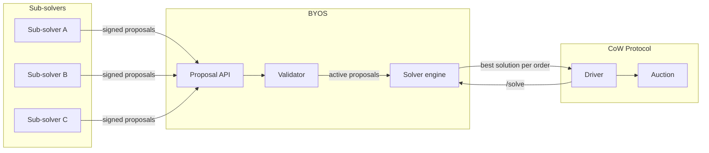

# What is BYOS

BYOS (Bring Your Own Solver) is a bonded CoW Protocol solver. It lets external routers — called sub-solvers — submit routes to CoW auctions. Sub-solvers do not need a bonding pool, a DAO vote, or KYC. They deposit collateral into an escrow and sign EIP-712 proposals.

From the protocol side, BYOS is one ordinary solver. The sub-solver relationship is internal.

1. Sub-solvers find orders in the CoW orderbook and compute routes.
2. Sub-solvers sign and submit proposals to BYOS.
3. BYOS validates each proposal in the background.
4. When the CoW driver calls `/solve`, BYOS returns its best proposal per order.
5. The driver settles the solution on-chain through a per-sub-solver Trampoline contract.
6. If the settlement reverts, BYOS debits the sub-solver's escrow.

## Documentation map

### [Design document](design-document)

The normative specification. It defines the order flow, the proposal schema, the penalty schedule, the scoring model, and the gas cut. All other documents refer to it. If a document and the design document disagree, the design document is correct.

### [Contracts reference](contracts)

Interface tables for Escrow, Trampoline, and TrampolineFactory: function signatures, events, errors, roles, and transfer restrictions. Use this page to look up a specific function or event. The [design document](design-document) explains why each contract works the way it does.

### [Service architecture](service)

The off-chain service: two-listener model, proposal ingestion, the `/solve` handler, background workers (validation, penalties, retention), the state machine, persistence, and the scoring and gas cut formulas. Use this page to understand how the service processes proposals.

### [Sub-solver integration guide](guides/sub-solver-integration)

Step-by-step instructions to go from zero to a settled proposal. Covers escrow deposit, proposal construction, signature, submission, and what happens after settlement. Start here if you want to integrate as a sub-solver.

### [Glossary](glossary)

Definitions for all domain terms. Every implementation repo uses this vocabulary.

### [SLO targets](operations/slo-targets)

Latency targets for `/solve`, `GET /proposals`, and the validation loop.

### [Trampoline / settlement isolation](security/trampoline-settlement-isolation)

Proof that a sub-solver's route cannot reach `GPv2Settlement` funds.

### CoW protocol reference

Background material on the CoW mechanisms BYOS depends on:

- [Fee collection](reference/cow-fee-collection) — how CoW collects and distributes fees.
- [Solver slashing policy](reference/cow-solver-slashing-policy) — the penalty framework BYOS mirrors for sub-solvers.
- [Solver auctions](reference/solver-auctions) — how the CoW auction and scoring work.
- [Solver CIPs](reference/solver-cips) — the CIPs that govern solver competition rules.
