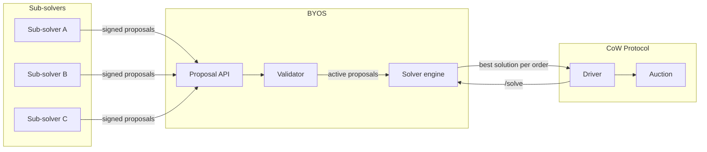

# What is BYOS

BYOS (Bring Your Own Solver) is a bonded CoW Protocol solver that opens CoW's order flow to **permissionless external routers** — called sub-solvers — without requiring them to go through the protocol's standard solver onboarding.

## The problem BYOS solves

Becoming a CoW solver today is a gated process:

| Requirement | Standard pool (CIP-7) | Reduced pool (CIP-44) |
|---|---|---|
| Capital | $500,000 in stablecoins + 1,500,000 COW | $50,000–$100,000 + 500,000–1,000,000 COW |
| Governance | Deploy a Gnosis Safe with CoW DAO as sole signer | Same Safe requirement |
| Vouching | Vouched by an existing solver or the DAO | Core-team approval required |
| Onboarding | Shadow competition and testing on Sepolia before mainnet access | Same requirement |
| Compliance | KYC through the vouching solver's pool | Same |

A DEX aggregator, a routing API, or an independent quant who can find good routes has no way to participate without first finding a bonding pool willing to vouch for them and locking up significant capital.

**After BYOS**, the barrier drops to a collateral deposit sized to cover one worst-case revert penalty (`gas + c_l`, where `c_l` is 0.010 ETH on mainnet) and the ability to sign an EIP-712 message and return a route.

## How it works

BYOS sits between sub-solvers and the CoW auction as a single bonded solver. From the protocol's perspective it is an ordinary solver. Internally, it sources its solutions from anyone willing to post collateral.

The flow:

1. **Sub-solvers find orders** in CoW's public orderbook and compute routes using any DEX or protocol.
2. **Sub-solvers sign and submit proposals** — EIP-712 messages committing to a specific order, route, and minimum output (`buyAmount` floor).
3. **BYOS validates** each proposal in the background: checks escrow balance, simulates the full settlement via `eth_estimateGas`, and scores it (`surplus - gas`).
4. **When the CoW driver calls `/solve`**, BYOS answers instantly from its pool of validated proposals — no RPC, no simulation on the hot path. It picks the highest-scoring proposal per order.
5. **The driver settles** the winning solution on-chain. The sub-solver's route executes inside a per-sub-solver sandbox contract (the Trampoline), isolated from settlement buffers.
6. **If the settlement reverts**, BYOS debits the sub-solver's escrow for `gas + c_l` (gas cost plus the per-auction lower reward cap).

## What sub-solvers get and don't get

| | Sub-solver | BYOS |
|---|---|---|
| **Route computation** | Responsible | Not involved |
| **Transaction submission** | Not involved | Responsible (via CoW driver) |
| **Scoring and auction bidding** | Not involved | Responsible |
| **Revenue from own venue fees** | Keeps any fees their route earns at the DEX level (e.g., LP fees on a pool they operate) | Not involved |
| **In-route surplus capture** | May capture surplus inside the route before the sweep ([details](design-document#residue)) | Keeps uncaptured surplus as settlement slippage |
| **Gas cut** | Not charged directly | Retains the estimated gas cost on every settled trade ([details](design-document#gas)) |
| **CoW solver rewards** | None in v1 — no reward pass-through | Retains 100% of CoW rewards earned under its bonded solver seat |
| **Escrow risk** | Bears Track A (revert) and Track B (EBBO) penalties | Absorbs shortfall when escrow is insufficient |

## How BYOS earns revenue

BYOS keeps the **gas cut** — the estimated gas cost of each settlement, denominated in the order's sell token. This is declared as a solver fee in the solution — a price wedge, not a deduction from the route. The difference stays in `GPv2Settlement`'s buffers and returns to BYOS via the weekly settlement payout. The protocol does not reimburse gas; what returns weekly is revenue BYOS retained from the trade.

Only settled trades generate revenue.

Additionally, BYOS retains all **CoW solver rewards** (CIP-20/CIP-85 performance and consistency rewards) earned under its bonded solver address. Reward pass-through to sub-solvers is out of scope for v1.

## Why proposals get discarded

A proposal can be rejected at multiple stages. Here is every reason, consolidated:

### At submission (synchronous, immediate 4xx)

| Reason | Meaning |
|---|---|
| Invalid signature | Malformed signature hex or recovery failure |
| Proposal expired | `validUntil` is already in the past |
| Lifetime exceeded | `validUntil` is more than 5 minutes in the future (configurable) |
| Rate limited | IP or signer rate limit exceeded |

### At validation (asynchronous, recorded on the proposal)

| Reason | Meaning |
|---|---|
| Insufficient escrow | Balance below the threshold (`gas estimate × gas price + minimum collateral`) |
| Order not found | Order UID not in CoW's orderbook (filled, expired, or cancelled) |
| Unsupported order | Non-ERC20 balance flavors, bridging orders, or (in v1) partially fillable orders |
| Amount mismatch | Proposal amounts don't match the order (fill-or-kill mismatch, or partial fill violates limits) |
| Unprofitable | Score (`surplus - gas`) is zero or negative on first simulation |
| Simulation failed | The full settlement simulation reverted — terminal on first occurrence, no retries |

### By lifecycle (not a rejection, but the proposal stops competing)

| State | Cause |
|---|---|
| Expired | `validUntil` passed |
| Cancelled | Sub-solver sent a signed `DELETE` |
| Settled | The proposal won an auction and settled on-chain |
| Settle failed | Settlement reverted on-chain — triggers a Track A penalty |

## The slashing policy

When a settlement carrying a sub-solver's route causes BYOS to incur a cost from CoW, BYOS recovers it from the sub-solver's escrow. There are two tracks:

**Track A — routine, fast, provable.** Covers reverts, deadline misses, and non-settlements. BYOS debits immediately with no prior approval, because the facts are on-chain and verifiable by anyone. The sub-solver gets a 72-hour dispute window on narrow grounds (wrong attribution, the transaction didn't actually revert, the amount exceeds the cap).

| Scenario | Debit amount |
|---|---|
| Settlement reverts on-chain | `gas used + c_l` |
| Settlement misses block deadline | `gas used + c_l` |
| Won auction, never settled | `10% of c_l` |

`c_l` is CoW's per-auction lower reward cap: **0.010 ETH** on Ethereum mainnet, **10 xDAI** on Gnosis.

**Track B — rare, slow, externally arbitrated.** Covers EBBO (Execution-Based Best Offer) violations and catch-all fairness claims. CoW's core team issues a certificate against BYOS; BYOS identifies the responsible sub-solver, freezes their escrow to block withdrawal, and gives them 36 hours to submit a refutation. The CoW core team — not BYOS — adjudicates. This means BYOS cannot fabricate a Track B claim, but it also cannot waive one.

Track B claims can arrive up to **three months** after the trade. If the sub-solver has already withdrawn or the escrow balance is insufficient, BYOS absorbs the difference.

**Simulation failures are free.** Only on-chain failures touch escrow. A proposal that fails simulation is dropped with no penalty.

For the full normative specification, see [the design document](design-document#penalties).
