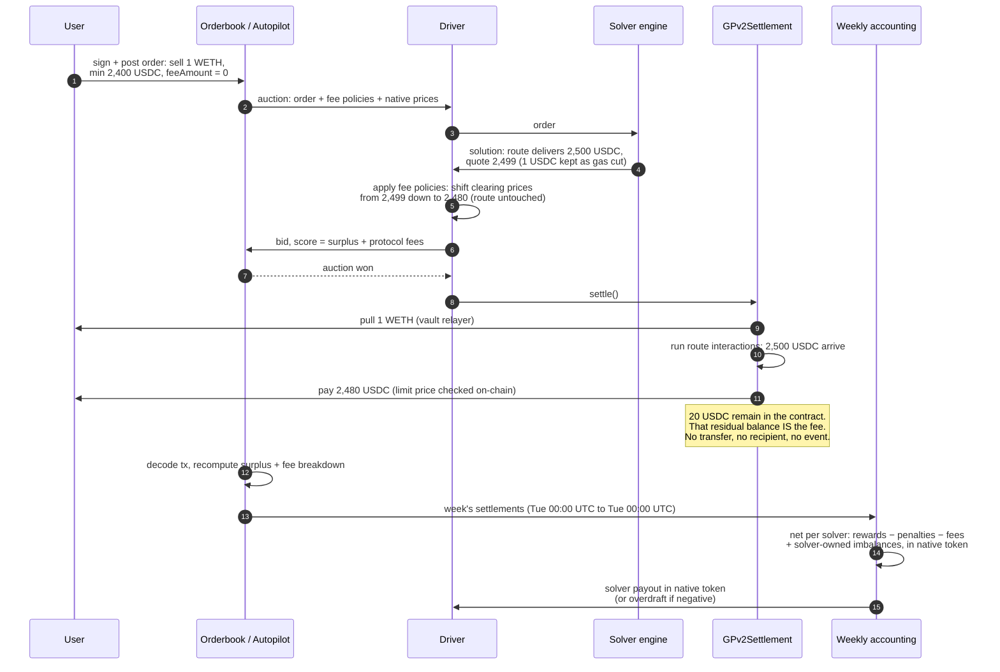
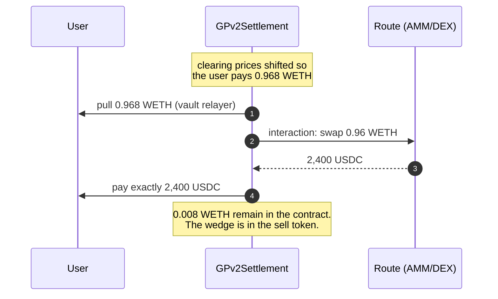
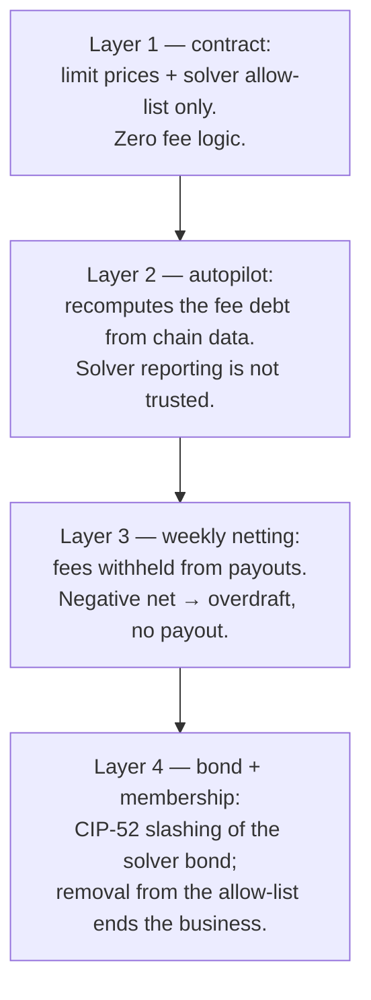

# CoW Protocol — Fee Collection & Enforcement (reference)

> Consolidated from the official docs, the settlement contract source, and the autopilot code.
> Captured 2026-07-21 while analyzing fee handling for BYOS. Sources:
> [settlement contract docs](https://docs.cow.fi/cow-protocol/reference/contracts/core/settlement),
> [accounting](https://docs.cow.fi/cow-protocol/reference/core/auctions/accounting),
> [rewards](https://docs.cow.fi/cow-protocol/reference/core/auctions/rewards),
> [governance fees](https://docs.cow.fi/governance/fees),
> [`GPv2Settlement.sol`](https://github.com/cowprotocol/contracts/blob/main/src/contracts/GPv2Settlement.sol),
> [`autopilot/src/domain/fee`](https://github.com/cowprotocol/services/blob/main/crates/autopilot/src/domain/fee/mod.rs),
> [`autopilot/src/domain/settlement`](https://github.com/cowprotocol/services/blob/main/crates/autopilot/src/domain/settlement/mod.rs).
>
> Why this matters for BYOS: separating the fee is the **solver's job**, done by pricing, not by
> the contract. In BYOS the executed amounts are signed by the sub-solver, so the fee wedge is
> under sub-solver control — see the BYOS section at the end, and
> [`#gas`](../design-document#gas) for what BYOS actually does with it.

## The one-sentence model

There is no fee logic on-chain. A fee is a **price wedge**: the solver pays the user slightly
less than the trade produced, the difference stays in `GPv2Settlement`'s balance, and once a week
the protocol computes off-chain who owes what and settles up.

## Fee types

| Fee | What it covers | Who receives it | How the amount is set |
|---|---|---|---|
| Network fee | Gas of the settlement | The solver — the cut parks in the settlement's buffers and reaches the solver through the weekly payout, in native token | Solver's own cut, typically in the sell token; the protocol does **not** reimburse gas |
| Protocol fee | CoW DAO revenue | CoW DAO | Fee policies attached to each order by the autopilot (surplus %, volume %, price improvement) |
| Partner fee | Integrator revenue | The partner | Declared in the order's appData, capped by the protocol |

Orders sign `feeAmount = 0` since the 2023 fee-model change. The `feeAmount` field and its
proportional-scaling math still exist in `GPv2Settlement.sol` but are a dead path for new orders.
All three fee types above travel the same physical route: a wedge in the executed prices.

## One order, end to end (a sell order)

One concrete example threaded through every component. The user sells 1 WETH for USDC with a
limit price of 2,400. The best route delivers 2,500 USDC. Total fees come to 20 USDC: 1 USDC
as the solver's gas cut, 19 USDC of protocol and partner fees.

1. The user signs the order — sell 1 WETH, receive at least 2,400 USDC, `feeAmount = 0` — and
   posts it to the orderbook API.
2. The autopilot puts the order into the next auction, attaching the fee policies (protocol
   surplus/volume fee, any partner fee from appData) and a native ETH price per token, and
   broadcasts the auction to all solvers.
3. The solver engine finds the route: 1 WETH in, 2,500 USDC out. It can ignore protocol and
   partner fees — the driver handles those next — but the gas cut is the engine's own job; the
   driver never inserts one. With gas estimated at about 1 USDC worth of ETH, the engine quotes
   2,499 to its driver while the route still delivers 2,500, keeping the difference. (The
   solver-driver API also has a legacy `fee` field for taking the cut in sell token instead.)
   Note the engine thinks in amounts and profitability only; it never builds clearing prices.
4. The driver applies the fee policies on top, by shifting only the clearing prices: 19 USDC
   of protocol and partner fees move the user's executed amount from 2,499 down to 2,480. The
   route calldata is untouched. It bids with score = user surplus + protocol fees.
5. The autopilot picks the winning bid and the driver submits `settle()`.
6. `GPv2Settlement` executes: pull 1 WETH from the user via the vault relayer, run the route
   interactions (2,500 USDC arrive in the contract), pay the user 2,480 USDC. The contract
   checks exactly two things — the user got at least their limit price, and the caller is an
   allow-listed solver. The 20 USDC difference just stays in the contract's ERC20 balance;
   that residual **is** the fee. No transfer, no recipient, no event. It sits commingled with
   everything else (the "buffers"), and solvers may even spend buffer balances as liquidity in
   later settlements.
7. The autopilot observes the settlement on-chain, decodes the calldata, matches it to the
   promised solution, and recomputes surplus and the fee breakdown from the executed amounts
   plus the auction's fee policies. Solver reporting is not trusted. The per-trade result is
   stored and public on Dune.
8. The weekly accounting (Tuesday 00:00 UTC to Tuesday 00:00 UTC) nets per solver: rewards,
   minus penalties, minus protocol and partner fees, plus the solver-owned imbalances its
   settlements created (gas cuts, slippage) converted to native token. Net positive pays out;
   net negative is recorded as an overdraft, backed by the bond.

Two consequences of the score formula worth remembering:

- Ranking is fee-neutral. Score counts protocol fees *as if collected*, computed by the autopilot
  from the executed amounts. A solver that skips the fee gives the user more surplus but the score
  is the same — skipping buys no competitive edge.
- The fee debt is independent of collection. The autopilot derives what the solver owes from the
  executed prices and the fee policies. Whether the solver actually kept a wedge only decides
  whether the debt is covered by retained balance or comes out of the solver's own rewards.

## The same trade as a buy order

The mechanism does not change with the order kind — only the side the wedge sits on. Suppose the
user instead signs a buy order: receive exactly 2,400 USDC, pay at most 1 WETH. The route needs
0.96 WETH to produce 2,400 USDC, and the same 20 USDC of fees is now 0.008 WETH.

The driver shifts the sell side of the price instead: the user pays 0.968 WETH, the route
consumes 0.96, and 0.008 WETH never leaves the contract. The user receives exactly the 2,400
USDC they signed for.

Side by side:

| | Sell order | Buy order |
|---|---|---|
| User fixes | the input: 1 WETH | the output: 2,400 USDC |
| Driver's price shift | proceeds down: route delivers 2,500, user receives 2,480 | payment up: route consumes 0.96 WETH, user pays 0.968 |
| Wedge sits in | buy token (USDC) | sell token (WETH) |
| Contract's limit check | received ≥ 2,400 USDC | paid ≤ 1 WETH |

Everything after `settle()` — recompute, weekly netting — is identical for both kinds.

## Enforcement layers

Nothing about fees is enforced by the contract. Enforcement is ex-post accounting (steps 7 and 8
above) against money the solver is owed, with the bond and the allow-list behind it. The layers,
inside-out:

The model is trust-minimized, not trustless: it works because the fee debt is deterministically
computable from on-chain data, and because a bonded solver has more at stake (bond + future
revenue) than any single week's shortfall. A solver that walks away is recoverable only up to its
bond — which is why solver onboarding is permissioned.

## Who does what — summary

| Step | Actor | On-chain? |
|---|---|---|
| Decide the fee amount per order | Autopilot (fee policies) + solver (network fee) | No |
| Separate the fee from the user's proceeds | The driver, by shifting clearing prices — the settlement contract has no fee logic and never checks the split | Encoded in calldata; not checked |
| Hold the fee | `GPv2Settlement` buffers, commingled | Yes, passively |
| Compute what each solver owes | Autopilot, from decoded calldata | No |
| Collect | Weekly accounting: withheld from payouts, transferred to DAO/partners | One accounting tx per week |
| Punish shortfalls | Overdraft → bond slashing → allow-list removal | Governance |

## Refinements from the CoW solvers team (meeting 2026-07-22, Haris Angelidakis)

Validated in a call with CoW's solver team; these sharpen or correct the docs-derived picture
above.

- The default driver does the protocol/partner fee separation itself, by post-processing the
  solver engine's solution. The engine reports raw route output ("route delivers 100 USDC"); the
  driver knows the fee policies and shifts only the clearing-price vector so the user receives
  98 and 2 stays in the settlement contract. Interactions calldata is never touched. A solver
  engine behind the default driver can be completely oblivious to protocol fees.
- Gas is never reimbursed. The solver takes its own cut from the trade (the solver-driver API has
  a legacy `fee` field for a sell-token cut; the driver will not insert one for you). After
  protocol/partner fees are accounted, all remaining imbalances a settlement created are solver
  property: positive gets paid out weekly, negative is owed.
- Solver-owned imbalances are converted to native token using observed exchange rates in roughly
  a one-hour window around the trade — not the auction's native prices (changed recently). The
  auction JSON's native prices are a sizing heuristic for the gas cut, occasionally bogus. An
  order cannot enter an auction without a native price. On L2s the protocol withdraws settlement
  contract fees roughly hourly; payouts stay weekly (Tuesday to Tuesday).
- CIP-74 (late 2025): per auction, a solver's reward is capped at the protocol fees its solutions
  collected — 50% of them on mainnet, Arbitrum, BNB (revenue split). Zero protocol fee collected
  means zero reward, even on a win. Unspent cap budget plus penalties fund CIP-85 consistency
  rewards (closeness-to-winner across all orders), computable only after the accounting week
  closes.
- Penalties are capped per auction (0.010 ETH on mainnet — the `c_l` in
  [the glossary](../glossary)). Negative weekly totals are recovered first from the solver's
  own collected native-token imbalances, then via the on-chain overdraft contract (event emitted;
  solver repays partially or fully).
- Real-time tracking: the competition endpoint exposes score and reference score per auction
  seconds after it closes (reward = score − reference); Dune lags ~2 hours. A driver callback
  reporting settle outcome / reward is a requested feature, not yet built.
- Batching context: with the fair combinatorial auction's multiple winners, single-order bids
  stay competitive; batch solutions matter in maybe 3–5% of auctions. CoW considers batch support
  a nice-to-have for a v0 BYOS, not a requirement.

## Why this matters for BYOS

Updated 2026-07-22 after the meeting above; the original 2026-07-21 analysis assumed BYOS applies
fee policies itself, which the CoW-run driver setup makes wrong.

BYOS joins the CoW bonding pool, so the CoW core team runs the driver (key custody requirement;
reduced pool $50k + 500k COW, full pool $500k + 1.5M COW, KYB for mainnet). That driver inserts
the protocol/partner fee wedge by price shift, downstream of anything the sub-solver signs.
Consequences:

1. Protocol-fee separation is not a BYOS job in the default setup. Sub-solver executions and
   outflows should be defined as **raw, pre-fee route amounts** — the same convention the
   solver engine uses toward the driver. The
   earlier concern that a sub-solver could size flows to leak the fee wedge into the trampoline
   ([`#residue`](../design-document#residue)) dissolves under this convention: the
   wedge is created by the driver's price shift after the raw amounts, so it lands in
   `GPv2Settlement`, not the instance.
2. The dispute model needs one amendment: on-chain `settle()` calldata will deviate from signed
   raw tuples by exactly the driver's fee transform. The transform is deterministic (policies are
   public per auction), so disputes must apply it to the signed tuples before comparing —
   see [`#proposal-schema`](../design-document#proposal-schema).
3. The gas cut is the piece BYOS truly owns. The driver won't take it, the protocol won't
   reimburse it, and CIP-74 caps the reward at 50% of protocol fees collected — so a settlement
   collecting no protocol fee earns nothing while BYOS pays gas. Gatekeeping must ensure each
   proposal leaves room for the gas cut *and* the driver's fee shift above the user's limit price;
   a sub-solver quoting exactly at the limit produces an infeasible solution.
4. Penalty passthrough is trackable per auction in near real time via the competition endpoint,
   which supports the planned per-sub-solver running balance with a cutoff at the known worst
   case (`c_l`).

The enforcement-layer mapping, revised: autopilot recompute → CoW-run driver (protocol fees) plus
BYOS gatekeeper (gas + feasibility); weekly netting → per-sub-solver running balance off the
competition endpoint; solver bond → escrow (sized for Track A); allow-list → proposal API access.
