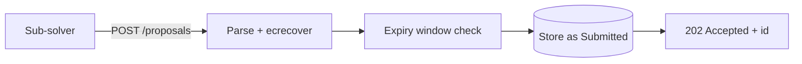
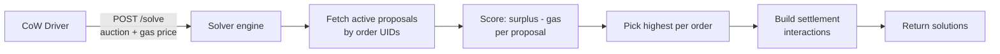
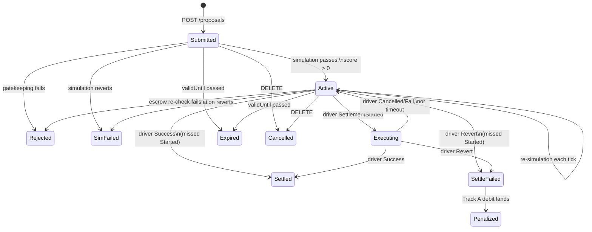

# Service architecture

The off-chain component of BYOS: a single-process service that ingests sub-solver proposals, validates them against the chain, scores them, and answers the CoW driver's `/solve` endpoint with candidate solutions.

Two implementations exist — a [Rust service](https://github.com/bleu/byos-service) and a [TypeScript migration](https://github.com/bleu/byos-service-ts). This page describes the shared architecture; implementation-specific ADRs live in each repo.

## Two-listener model

The service binds two ports on one process, with opposite trust boundaries:

| Listener | Default port | Serves | Trust level |
|---|---|---|---|
| **Public** | 9585 | `/proposals` (POST), `/proposal/:id` (GET, DELETE), `/proposals/by-sub-solver` (GET), `/proposals/:orderUid` (GET), `/buffer-balance` (GET) | Internet-reachable |
| **Internal** | 9586 | `/solve`, `/notify` | Firewalled, driver-only |

They never share a socket. A `/solve` response contains the full standing proposal book for an auction — amounts, routes, and signatures, all MEV-relevant — so it must not be reachable from the public internet. An optional bearer token on `/solve` provides defense in depth.

## Request flow

### Proposal ingestion (public)



The request path does three things inline: parse, `ecrecover`, and expiry-window check. On success, the proposal is stored as `Submitted` and answered `202` — meaning "accepted for validation", not "accepted".

**All on-chain work is deferred.** The escrow balance check and settlement simulation run in a background validator loop, not on the request path. This decouples response latency from blockchain health and prevents DDoS on the public port from starving `/solve`.

### Solving (internal)



`/solve` is the hot path — **no RPC, no simulation, no writes** beyond recording the solution-to-proposal mapping. It reads from Postgres (indexed by order UID), scores with cached gas estimates, computes CREATE2 addresses locally, and ABI-encodes the two interactions (transfer + execute). Target latency: p99 < 100ms.

### Settlement outcomes (internal)

The CoW driver notifies BYOS of outcomes via `POST /notify`. There is no chain watcher and no driver fork.

| Notification | Proposal transition |
|---|---|
| `SettlementStarted` | `Active` → `Executing` |
| `Success { transaction }` | `Active` or `Executing` → `Settled` |
| `Revert { transaction }` | `Active` or `Executing` → `SettleFailed` (triggers Track A debit) |
| `Cancelled` / `Expired` / `Fail` | `Executing` → `Active` (queues non-settlement debit) |

`/notify` joins to proposals through the `(auction_id, solution_id, proposal_id)` mapping that `/solve` records synchronously before returning solutions.

## Background workers

Three background loops run alongside the HTTP listeners:

### Validation loop

Runs every ~12 seconds (one block):

1. **Release stale executing proposals** — proposals stuck in `Executing` for more than 5 minutes (lost notification or restart) fall back to `Active`.
2. **Expire proposals** — any `Submitted` or `Active` proposal with `validUntil < now` transitions to `Expired`.
3. **Validate remaining proposals** — for each `Submitted` or `Active` proposal:
   - **Escrow check** (cheap): `effectiveBalance(subSolver) >= ESCROW_GAS_ESTIMATION × gas_price + min_collateral`, where `ESCROW_GAS_ESTIMATION` is a fixed 200k gas floor. Reject if insufficient.
   - **Order envelope check** (no RPC): ERC20 balances only, no bridging orders, amounts consistent with order kind. For sell orders: `order.buyAmount <= minBuyAmount <= quoteBuyAmount`, `quoteBuyAmount` beats the limit price. For buy orders: `minBuyAmount == quoteBuyAmount == order.buyAmount` (hard-reject otherwise). Partially fillable orders use the same constraints against scaled amounts.
   - **Settlement simulation** (expensive): full `settle()` via `eth_estimateGas` with state overrides. Records gas used, trampoline address, and token addresses on success.
   - **Profitability gate** (first validation only): `score = surplus - gas > 0`. Not re-applied on re-validation to avoid gas-price flapping churn.

A simulation revert is **terminal on first occurrence** — no strikes, no retries.

### Penalty loop

Runs on the same interval as validation. Processes Track A debits and post-settlement buffer accounting:

1. For each `SettleFailed` proposal: fetch settlement tx receipt, compute `gas_used × effective_gas_price + c_l`, call `escrow.debit(subSolver, amount, txHash)`.
2. For each pending non-settlement debit: call `escrow.debit(subSolver, 0.1 × c_l, orderUidHash)`.
3. **Buffer ledger** — for each `Settled` proposal where `minBuyAmount < quoteBuyAmount` and no ledger entry exists yet: read the `Executed` event's `delta` from the settlement tx receipt, compute the signed gap (`quoteBuyAmount − delta`), convert to native token at the auction's reference price (stored in the `solutions` table), and insert a `buffer_entries` row. Positive entries mean under-delivery (debit); negative entries mean over-delivery (credit). Over-delivery credits offset future shortfalls but are never paid out. Then, for each affected sub-solver: sum uncleared entries. If the outstanding balance exceeds `c_l`, debit the full balance from escrow in one transaction, mark all entries as cleared, and emit a `bufferDebited` audit event.
4. On success: transition to `Penalized` (for Track A), record the debit tx hash.
5. Retry up to 10 times on transient failures, then park for operator investigation.

### Retention sweep

Runs every ~5 minutes. Deletes terminal proposals (`Rejected`, `SimFailed`, `Expired`, `Cancelled`) that have been in their terminal state for more than 1 hour. Money states (`Settled`, `SettleFailed`, `Penalized`) are kept indefinitely — they are dispute evidence.

## Proposal lifecycle



A state answers one question: **what does the service do with this proposal right now?**

| State | Simulated? | Offered to `/solve`? | Cancellable? |
|---|---|---|---|
| `Submitted` | First pass pending | No | Yes |
| `Active` | Every tick | Yes | Yes |
| `Executing` | No | No | No |
| `Rejected` / `SimFailed` / `Expired` / `Cancelled` | No | No | No |
| `Settled` / `SettleFailed` / `Penalized` | No | No | No |

Transitions are **compare-and-swap** — zero rows affected means the caller's verdict was stale (a cancellation or notification won the race).

## Persistence

Postgres is the source of truth:

| Table | Purpose | Retention |
|---|---|---|
| `proposals` | Current state — read by `GET`, `/solve`, `/notify`, and the validator | Live proposals indefinite; terminal states swept after 1 hour (except money states) |
| `audit_events` | Append-only history — what happened, when, why | No deletion path. Dispute evidence for Track B claims arriving up to 3 months later. |
| `solutions` | Attribution mapping `(auction_id, solution_id) → proposal_id`. Also stores the buy token's reference price from the auction for post-settlement buffer accounting. | Indefinite |
| `buffer_entries` | Signed ledger of per-proposal buffer amounts for proposals using loose slippage (`minBuyAmount < quoteBuyAmount`). Each entry records the buy token, the gap between `quoteBuyAmount` and the delivered `delta`, converted to native token. Entries accumulate until the balance exceeds `c_l`, then are cleared in batch. Indexed by `(sub_solver, cleared)` and `proposal_id`. | Indefinite |
| `penalties` | Pending non-settlement debits (queued by `Cancelled`/`Expired`/`Fail` notifications) | Processed by the penalty loop, then retained |

The audit trail uses a write-behind pattern: events are emitted after their proposal write commits, persisted by a dedicated background worker. This decouples audit codec evolution from the store's hot path. The crash window (state change committed, audit event not yet persisted) is accepted at one event per crash.

## Scoring

```
score = surplus - gas
```

- **Surplus**: improvement beyond the order's limit price (extra buy tokens on a sell order, sell tokens kept back on a buy order), computed from `quoteBuyAmount` and converted at the auction's reference price.
- **Gas**: simulated `eth_estimateGas` result + 30k buffer, times the auction's effective gas price.

There is no fee term. CoW's score is `surplus + protocol fees`, and the protocol fee cancels out of ranking. Once the gas cut equals the gas cost, `surplus - gas` matches what the autopilot computes.

BYOS's score is a **pre-ranking** that decides which proposals deserve the driver's encoding budget. The driver re-scores after encoding and simulation.

## Gas cut

BYOS keeps the estimated gas cost of each settlement, in the order's sell token, as its revenue. It is declared as the fulfillment's `fee` field — a price wedge, not a deduction from the route.

```
effective_gas = gas_used + 30k buffer
cut_in_wei = effective_gas × effective_gas_price
cut_in_sell_tokens = ceil(cut_in_wei × 10^18 / sell_token_price)
```

The cut is **not padded** — a larger cut lowers the score, which lowers CIP-85 consistency rewards. A proposal is skipped if the cut would breach the user's signed limit.

## Key design decisions

Rationale for each decision lives in the ADRs of [byos-service](https://github.com/bleu/byos-service/tree/main/docs/adr) and [byos-service-ts](https://github.com/bleu/byos-service-ts/tree/main/docs/adr). This section summarizes the final state.

### Async ingestion

The request path does only signature + expiry checks. Escrow and simulation validation run in the background.

A `2xx` from `POST /proposals` means "accepted for validation", not "accepted".

### No chain watcher

Settlement outcomes come from the stock CoW driver's `/notify` endpoint, not from scanning blocks. This covers private submissions and dropped transactions that a block scanner would miss. Missed-deadline detection comes free from `Cancelled` and `Expired` notifications.

### Owner-scoped reads

All `GET` endpoints require an EIP-712 signature, and the recovered signer scopes the response. Non-owners get `404`, not `403`, to prevent existence-oracle attacks.

### First-revert-terminal simulation

A proposal that fails simulation once is not re-simulated.

### Profitability gate on first validation only

A score of zero or less rejects as `Unprofitable` on the first simulation, matching `/solve`'s inclusion rule. It is not re-applied on re-validation — gas prices wobble, and rejecting on a spike would churn proposals that are profitable again two blocks later.

### Proposal lifetime cap

`validUntil` more than 5 minutes in the future is rejected at ingestion. This bounds worst-case simulation cost per proposal and guarantees the expiry sweep arrives within a known window.

### One sub-solver per settlement transaction

The per-sub-solver Trampoline CREATE2 address in the calldata identifies which sub-solver's route ran. The driver's `SolutionMerging` is set to `Forbidden` to prevent silent batching.

### Compare-and-swap transitions

All state transitions check the expected current state before updating. Zero rows affected means a concurrent transition won — a cancellation, a notification, or an expiry sweep raced and won. No stale overwrites.
